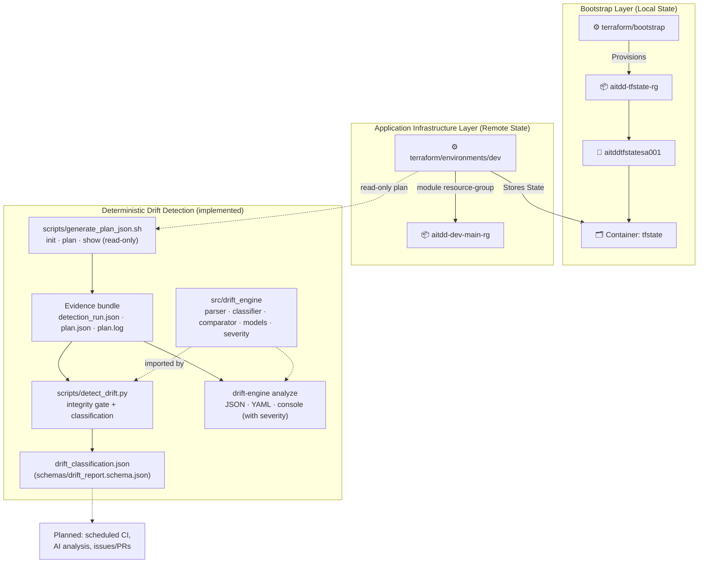

# AI-Powered Terraform Drift Detection & Remediation Platform

> Detect, analyze, and remediate infrastructure drift in Azure using Terraform, Python, LangGraph, and GitHub automation.

The **deterministic** part works today: Terraform plan evidence, drift classification and a
typed Python drift engine. The AI part (LangGraph/LLM analysis) and the automation around
it are **planned, not yet built**. See [What works today](#-what-works-today) and
[Planned](#-planned-not-yet-implemented).

---

## 📌 Current Status

**Phase 4 — Python Drift Engine** 🟡 In progress (Tasks 4.1–4.6 complete; next: Task 4.7, logging / error handling / coverage)

| Phase | Status |
|---|---|
| 1 — Minimal Terraform foundation | ✅ Complete |
| 2 — Remote state & OIDC authentication (plan-only CI) | ✅ Complete |
| 3 — Deterministic drift detection, validated against a real Azure change | ✅ Complete |
| 4 — Python drift engine | 🟡 6 of 7 tasks complete |

[PROJECT_PLAN.md](PROJECT_PLAN.md) is the single source of truth for task status, acceptance
criteria and validation evidence.

---

## 🎯 Project Overview

Infrastructure drift is the divergence between Terraform state and the real Azure
resources. Manual changes, failed deployments and policy overrides introduce configuration
gaps that can lead to security vulnerabilities, compliance violations and outages.

### ✅ What works today

- **Read-only drift evidence**: `scripts/generate_plan_json.sh` runs `terraform init`,
  `plan -detailed-exitcode` and `show -json` (never `apply`). It writes an evidence bundle
  (run manifest, plan log, `plan.json`) outside the repository.
- **Deterministic drift classification**: `scripts/detect_drift.py` re-checks the
  evidence (integrity gate) and classifies every managed resource:
  - external drift, external deletion, converged drift, configuration change, added,
    removed, drift plus configuration change, or undetermined;
  - per-attribute detail with recorded / real / desired values;
  - sensitive values redacted.
  The output follows [`schemas/drift_report.schema.json`](schemas/drift_report.schema.json).
- **Validated against real Azure drift**: a scripted external tag change on the `dev`
  resource group was detected exactly (one attribute, `tags.aitdd_drift_probe`) and
  reverted (Tasks 3.6–3.7).
- **Python drift engine** (`src/drift_engine/`): plan parser, classifier, strict Pydantic
  report models, attribute comparator with noise and user-configured assessment, a
  rules-based severity rating, and the `drift-engine analyze` command with JSON, YAML and
  console output. See [Python drift engine](#-python-drift-engine).
- **Plan-only CI with OIDC**: GitHub Actions authenticates to Azure without stored secrets
  and runs `terraform plan`; the identity has no write permissions.

### 🔜 Planned (not yet implemented)

These are on the roadmap ([PROJECT_PLAN.md](PROJECT_PLAN.md)) and **do not exist yet**:

- Structured logging, error-handling review and a coverage gate for the engine (Task 4.7)
- Scheduled drift detection in GitHub Actions (Phase 5)
- **AI-powered analysis with LangGraph + an LLM** (Phase 6)
- Azure Activity Log investigation of who or what changed a resource (Phase 7)
- GitHub Issue/PR automation (Phase 8)
- DevSecOps scanning and FinOps cost analysis (Phases 9–10)
- Human-approved remediation (Phase 11)
- Dashboard (Phase 13)

### Core principles

- Terraform is the source of truth for **whether** drift exists. AI will interpret,
  explain and recommend; it never decides drift.
- Detection works **without an LLM**. A failed detection is reported as *unknown*, never
  as "no drift".
- "Drift detected" is a valid result, not a pipeline failure.
- No autonomous `terraform apply`. Remediation will require explicit human approval.

---

## 🏗️ Architecture



The [drift detection spec](docs/drift-detection-spec.md) defines the detection contract:
commands, exit codes, integrity gate, classification rules and the AI boundary.
[docs/architecture.md](docs/architecture.md) documents the Phase 1–2 design (backend,
security controls, OIDC flow). It predates Phases 3–4 and has not been updated for them.

---

## 🛠️ Technology Stack

| Technology | Version | Purpose |
|---|---|---|
| Terraform | `>= 1.6.0` (configuration); 1.14.7 pinned for detection and CI | Infrastructure as Code; plan evidence |
| AzureRM Provider | `~> 5.0` | Azure resource management |
| Azure CLI | 2.x | Local authentication; drift scenario scripts |
| Python | `>= 3.11` (tested on 3.13 and 3.14) | Drift classification and engine |
| Pydantic | `>= 2.11, < 3` | Strict report models |
| PyYAML | `>= 6.0, < 7` | `--format yaml` output |
| pytest, pytest-cov, jsonschema | dev extras | Tests and schema validation |
| GitHub Actions | `actions/checkout@v4`, `azure/login@v3`, `hashicorp/setup-terraform@v3` | Plan-only CI with OIDC |

`scripts/detect_drift.py` and the engine modules it imports use only the Python standard
library, so they run with plain `python3`. Pydantic and PyYAML are needed only for
`drift_engine.models` and the installed `drift-engine` command.

---

## ☁️ Azure Infrastructure Resources

### Remote State Storage (Phase 2 Bootstrap)

| Resource | Name | Location | Purpose |
|---|---|---|---|
| Resource Group | `aitdd-tfstate-rg` | `Central India` | Dedicated state storage RG |
| Storage Account | `aitddtfstatesa001` | `Central India` | Encrypted, versioned state storage |
| Blob Container | `tfstate` | N/A | Private container for `.tfstate` files |
| State Blob | `dev.tfstate` | N/A | Remote state for the `dev` environment |

### Application Infrastructure (`dev`)

| Resource | Name | Location | Purpose |
|---|---|---|---|
| Resource Group | `aitdd-dev-main-rg` | `Central India` | The only managed application resource; target of drift detection |

The minimal footprint is deliberate: one resource group is the MVP drift target. No
network, storage or Key Vault modules exist in this repository. More resource types are
planned for a later infrastructure-expansion phase.

---

## 📁 Repository Structure

```
.github/workflows/
└── terraform-auth-test.yml       # OIDC authentication + terraform plan (plan-only)

terraform/
├── bootstrap/                    # Remote-state storage (local state)
├── modules/
│   └── resource-group/           # for_each-driven resource group module
└── environments/
    └── dev/                      # Dev environment (remote state, dev.tfvars)

scripts/
├── generate_plan_json.sh         # Read-only plan evidence bundle (Task 3.2)
├── detect_drift.py               # Drift classification script; thin wrapper over drift_engine
└── validate.sh                   # terraform fmt -check + validate (no Azure auth)

src/drift_engine/                 # Python drift engine (Phase 4)
├── parser.py                     # plan.json loading, integrity gate, S/R/D extraction (4.2)
├── models.py                     # Strict Pydantic report models (4.3)
├── comparator.py                 # Attribute diff, noise and configuration assessment (4.4)
├── severity.py                   # Rules-based severity rating (4.5)
├── classifier.py                 # Resource classification and report building (moved in 4.6)
├── formatters.py                 # JSON / YAML / console rendering (4.6)
└── cli.py                        # drift-engine command (4.6)

schemas/
├── drift_report.schema.json      # Report contract (JSON Schema 2020-12)
└── examples/drift_report.json    # Sample report from a real fixture

tests/
├── fixtures/plan_evidence/       # Sanitized real plan evidence (11 scenarios)
├── scenarios/                    # Azure CLI tag-drift inject / revert / runner (Task 3.6)
└── test_*.py                     # Unit tests (see Testing)

docs/
├── drift-detection-spec.md       # Detection contract (Phases 3–4)
├── MASTER_PROJECT_GUIDE.md       # Project walkthrough
└── architecture.md               # Phase 1–2 design

pyproject.toml / requirements.txt # Python package and dev environment
PROJECT_PLAN.md                   # Roadmap and task status (source of truth)
```

---

## 🔎 Running Drift Detection

Detection is **read-only**: it never runs `terraform apply` and never changes Azure.
It needs Azure access that can read state and run `terraform plan` for `dev` (locally via
`az login`).

```bash
export ARTIFACT_DIR="$(mktemp -d)"   # must be absolute, empty, and outside the repository
./scripts/generate_plan_json.sh
python3 scripts/detect_drift.py "$ARTIFACT_DIR"
```

`detect_drift.py` writes `$ARTIFACT_DIR/drift_classification.json` and prints a summary,
for example `has_drift=true  [external_drift=1]`. The installed `drift-engine analyze`
command produces the same report (see below).

**Exit codes** describe the process, not the drift verdict:

| Script | `0` | `1` | `64` |
|---|---|---|---|
| `generate_plan_json.sh` | run succeeded (plan exit 0 or 2; see manifest) | detection failed | unusable `ARTIFACT_DIR` |
| `detect_drift.py` | evidence valid and classified (drift or not) | evidence failed or rejected: drift status **unknown** | artifact directory missing |

Evidence bundles and reports can contain resource IDs and must stay outside the repository.
`plan.json` and `tfplan` are gitignored.

---

## 🐍 Python Drift Engine

`src/drift_engine/` is the Phase 4 package. The parsing, diff and classification code was
**moved out of** `scripts/detect_drift.py` (not rewritten), and the script now imports it.
The script's output is unchanged.

| Module | Task | What it does |
|---|---|---|
| `parser.py` | 4.2 | Loads `plan.json` (50 MiB limit) and re-applies the integrity gate, including checks that each resource entry's identity fields (address, mode, type, name, index, …) have the shapes Terraform writes. It extracts recorded / real / desired views per managed resource. Bad input raises `EvidenceError`, never another exception. |
| `models.py` | 4.3 | Strict, immutable Pydantic models (`DriftReport`, `DriftSummary`, `DriftItem`, `AttributeChange`) that mirror `schemas/drift_report.schema.json`. They round-trip the classifier JSON exactly. |
| `comparator.py` | 4.4 | Deep attribute diff, plus an assessment of each changed path as `configured` (set in the Terraform configuration), `noise` (declarative rules: computed IDs, timeouts, timestamps, read-only metadata), `unconfigured` or `undetermined`. It annotates only: nothing is dropped and only proven noise is excluded from "significant". |
| `classifier.py` | 4.6 | Resource classification (spec §6) and report building, moved from the script so the CLI and the script share one implementation. |
| `formatters.py`, `cli.py` | 4.6 | `drift-engine analyze`: JSON (default), YAML or console output. See below. |
| `severity.py` | 4.5 | Deterministic, rules-based `CRITICAL` / `HIGH` / `MEDIUM` / `LOW` / `INFO` per change and per resource. Examples: Key Vault access policies, NSG inbound rules open to any source and public storage access rate `CRITICAL`/`HIGH`; tags and descriptions rate `LOW`; proven noise rates `INFO`; changes no rule covers default to `MEDIUM`. |

Install for development (a virtual environment is recommended):

```bash
python3 -m venv .venv
source .venv/bin/activate
pip install -e ".[dev]"
```

### `drift-engine analyze`

```bash
# JSON report to a file (the run manifest enables the full integrity gate)
drift-engine analyze --plan "$ARTIFACT_DIR/plan.json" --manifest "$ARTIFACT_DIR/detection_run.json" --output report.json

# Human-readable view in the terminal
drift-engine analyze --plan "$ARTIFACT_DIR/plan.json" --manifest "$ARTIFACT_DIR/detection_run.json" --format console
```

| Option | Meaning |
|---|---|
| `--plan PATH` | `plan.json` from `terraform show -json` (required) |
| `--manifest PATH` | Run manifest (`detection_run.json`). Without it, the plan exit-code and Terraform-version checks are skipped, `run` holds only nulls, and a warning is printed. |
| `--output PATH` | Write to a file instead of standard output; a one-line summary is printed |
| `--format json\|yaml\|console` | `json` (default) and `yaml` are the report itself; `console` is a readable view |
| `--color auto\|always\|never` | ANSI colors for `console` (`auto`: terminal only, honours `NO_COLOR`) |

- **JSON and YAML** are the report defined by
  [`schemas/drift_report.schema.json`](schemas/drift_report.schema.json), checked against the
  Pydantic models before writing. With `--manifest`, the JSON is byte-identical to what
  `scripts/detect_drift.py` writes for the same bundle.
- **Console** adds, for reading only, the deterministic severity and the configured/noise
  assessment per change. Noise is listed, not hidden. A failed run is shown as
  "drift status UNKNOWN", never as "no drift".

| Exit code | Meaning |
|---|---|
| `0` | Evidence valid and classified (drift or not) |
| `1` | Evidence failed or rejected: drift status unknown. The failed report is still written. |
| `2` | Usage error |
| `70` | The report would break the report contract. Nothing is written and drift status is unknown. Defense in depth: the integrity gate rejects malformed input first, so this indicates an engine defect. |
| `73` | The output file could not be written |

### Library use

```python
from drift_engine import comparator, parser, severity
from drift_engine.models import DriftReport

raw = parser.load_json("/path/outside/repo/plan.json", parser.PLAN_STAGE)
parsed = parser.parse_plan(raw)
comparisons = comparator.compare_plan(parsed, comparator.configured_attributes(raw))
for rated in severity.plan_severity(parsed, comparisons):
    print(rated.severity, rated.address, rated.reasons)

with open("/path/outside/repo/drift_classification.json", encoding="utf-8") as fh:
    report = DriftReport.model_validate_json(fh.read())
```

**Not in the report:** severity and the configured/noise assessment appear in the console
view and the library only. They are **not written into the JSON/YAML report**, because the
report schema and models do not contain them yet. All engine rules are deterministic. None
of this uses an LLM.

---

## 🧪 Testing & Validation

```bash
# Full suite (inside the dev virtual environment)
pytest

# Without installing anything: the Pydantic-dependent tests are skipped
python3 -m unittest discover -s tests

# Terraform format + validate (no Azure authentication)
./scripts/validate.sh
```

State after Task 4.6: **243 tests pass** with `pytest` (Python 3.13 and 3.14). With plain
`python3` and no installation, the same 243 run and 62 are skipped (they need Pydantic and
PyYAML).

| Test file | Covers | Tests |
|---|---|---|
| `test_detect_drift.py` | Classification, integrity gate, attribute detail, redaction, CLI exit codes | 63 |
| `test_parser.py` | Parser: real fixtures, missing/null/unknown fields, malformed input and identity fields, 50 MiB limit | 38 |
| `test_models.py` | Models: strict types, JSON round trip, agreement with the JSON Schema | 25 |
| `test_comparator.py` | Diff, configured vs noise assessment, Azure-shaped acceptance cases | 35 |
| `test_severity.py` | Severity rules, escalation, floors, edge cases | 45 |
| `test_cli.py` | `drift-engine analyze`: every format, plan-only and manifest modes, failures, exit codes, console view | 35 |
| `test_package.py` | Package installation smoke test | 2 |

**Live drift scenario** (changes Azure, then reverts it; explicit opt-in):

```bash
tests/scenarios/run_rg_tag_drift_scenario.sh           # read-only: preflight + baseline
tests/scenarios/run_rg_tag_drift_scenario.sh --apply   # inject tag drift, detect, revert, re-detect
```

Its approved run on 2026-10-02 passed 18/18 checks (Task 3.6). Additional validation per
task (golden-output comparisons, fuzzing, mutation checks) is recorded in the completion
notes in [PROJECT_PLAN.md](PROJECT_PLAN.md). No CI workflow runs the Python tests yet.

---

## 🚀 Deployment & Operations Guide

### 1. Authenticate with Azure Locally

```bash
az login
az account set --subscription "<your-subscription-id>"
```

### 2. Provision the Remote State Backend (Bootstrap)

Already provisioned for this project. For a new setup, the backend storage must exist
before the environment can use its remote backend:

```bash
cd terraform/bootstrap
terraform init
terraform plan
# Apply bootstrap after reviewing plan (requires user approval):
terraform apply
```

### 3. Initialize and Plan the Dev Environment

```bash
cd terraform/environments/dev
terraform init
terraform validate
terraform plan -var-file="dev.tfvars"
```

The one-time migration from local to remote state (`terraform init -migrate-state`) was
completed in Phase 2. A fresh clone only needs `terraform init`.

---

## 🔐 GitHub Actions OIDC Authentication Setup

This project uses **GitHub OIDC / Azure Federated Identity Credentials**. No long-lived
client secret, certificate, or storage account access key is used anywhere — the app
registration holds zero credentials.

### Azure Setup Steps

1. **Create the Entra App Registration & Service Principal** (this project uses
   `aitdd-github-oidc`):
   ```bash
   az ad app create --display-name "aitdd-github-oidc" --sign-in-audience AzureADMyOrg
   az ad sp create --id "<app-id>"
   ```

2. **Add the Federated Identity Credential** linking the repository's `main` branch to
   Entra ID:
   - **Issuer**: `https://token.actions.githubusercontent.com`
   - **Audience**: `api://AzureADTokenExchange`
   - **Subject identifier**: must match GitHub's `sub` claim **exactly** — Entra does not
     support wildcards, and a mismatch fails the token exchange *silently, with no error*.

   > **Pick the right subject format.** Repositories created **after 2026-07-15** use
   > GitHub's **immutable** subject format, which embeds numeric owner and repository IDs:
   >
   > ```
   > repo:OWNER@OWNER-ID/REPO@REPO-ID:ref:refs/heads/main
   > ```
   >
   > Older repositories use the legacy form `repo:OWNER/REPO:ref:refs/heads/main`.
   > This repository was created after the cutoff and therefore uses the immutable
   > format. Retrieve the two IDs from
   > `https://api.github.com/repos/<owner>/<repo>` (`owner.id` and `id`).

3. **Assign least-privilege Azure RBAC** — exactly these two, and nothing more:
   - `Reader` at **subscription** scope — read-only metadata for `terraform plan`
   - `Storage Blob Data Contributor` scoped to the **`tfstate` container** (not the
     storage account, not the subscription)

   `Contributor` is **not** assigned. CI is plan-only; see
   [Security Principles](#-security-principles).

   > Creating role assignments requires **Owner** or **User Access Administrator**.
   > A `Contributor` account cannot create them.

4. **Add GitHub repository secrets** under *Settings → Secrets and variables → Actions*:
   - `AZURE_CLIENT_ID` — the App Registration's Application (client) ID
   - `AZURE_TENANT_ID`
   - `AZURE_SUBSCRIPTION_ID`

   These are referenced by the workflow as `${{ secrets.* }}`; their values are
   intentionally not recorded in this repository.

5. **Verify** by running the `terraform-auth-test.yml` workflow. A green run proves the
   federated credential, the secrets, and the RBAC scopes are all correct together.

> Only the `main` branch has a federated credential. The workflow also triggers on pull
> requests, and those runs are expected to fail at Azure login until a pull-request
> credential is added or that trigger is removed (an open decision).

---

## 🔒 Security Principles

| Principle | Implementation |
|---|---|
| Backend Isolation | State storage is separated from app storage. |
| No Committed Secrets | Credentials, tokens, state files and plan artifacts are gitignored; drift evidence is written outside the repository. |
| OIDC Authentication | Workload Identity replaces static Azure client secrets in GitHub Actions. |
| State Security | State blob versioning enabled; container set to private. |
| Least Privilege | Exactly two RBAC assignments on the CI identity: `Reader` (subscription) and `Storage Blob Data Contributor` (`tfstate` container). No `Contributor`, `Owner`, or `User Access Administrator`. |
| Plan-Only CI | GitHub Actions has **no autonomous `terraform apply` capability**, enforced by RBAC rather than convention — the identity holds no write actions. Any future remediation/apply capability would require explicit human approval. |
| No Storage Account Keys | `listkeys` is denied to the CI identity, so state access uses Entra ID on the data plane (`ARM_USE_AZUREAD=true`) instead of account keys. |
| Sensitive Values Redacted | Values Terraform marks sensitive are never emitted in drift reports. |

---

## 🗺️ Project Roadmap

| Phase | Description | Status |
|---|---|---|
| 1 | Terraform + Azure foundation (minimal baseline) | ✅ Complete |
| 2 | Remote state backend + secure auth (plan-only CI) | ✅ Complete |
| 3 | Deterministic Terraform drift detection | ✅ Complete |
| **4** | **Python drift engine** | 🟡 In progress (4.1–4.6 done; 4.7 logging/coverage remaining) |
| 5 | Scheduled GitHub Actions drift detection | ⬜ Planned |
| 6 | LangGraph AI analysis | ⬜ Planned |
| 7 | Azure Activity Log investigation | ⬜ Planned |
| 8 | GitHub Issue/PR automation | ⬜ Planned |
| 9 | DevSecOps scanning | ⬜ Planned |
| 10 | FinOps / Infracost | ⬜ Planned |
| 11 | Human-approved remediation | ⬜ Planned |
| 12 | Testing and hardening | ⬜ Planned |
| 13 | Professional dashboard | ⬜ Planned |
| 14 | Final documentation / demo | ⬜ Planned |

### Known limitations (current state)

- Only one Azure resource type (resource group) is managed and drift-tested. Rules for Key
  Vault, NSG and storage are verified on synthetic plans only.
- Detection is run manually or by the scenario script; it is not scheduled (Phase 5).
- Terraform reports drift only for resources and attributes it manages. Unmanaged resources
  are invisible to this method ([spec §6.3](docs/drift-detection-spec.md#63-limitations--stated-not-hidden)).
- The report file is named `drift_classification.json`; the plan calls it `drift_report.json`.
  Both refer to the same document.

---

## 📄 License

This project is licensed under the [MIT License](LICENSE).
