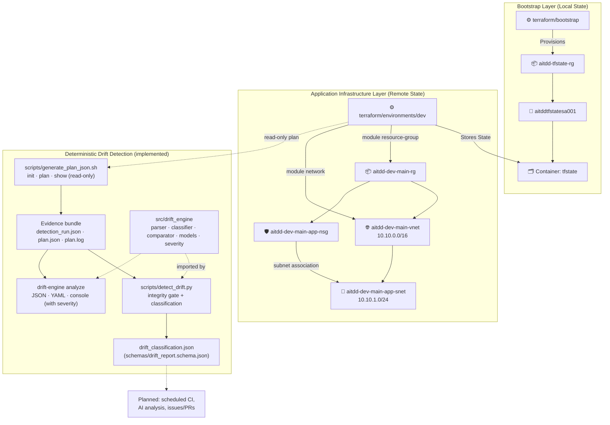

# AI-Powered Terraform Drift Detection & Remediation Platform

> Detect, analyze, and remediate infrastructure drift in Azure using Terraform, Python, LangGraph, and GitHub automation.

The **deterministic** part works today: Terraform plan evidence, drift classification and a
typed Python drift engine. The AI part (LangGraph/LLM analysis) and the automation around
it are **planned, not yet built**. See [What works today](#-what-works-today) and
[Planned](#-planned-not-yet-implemented).

---

## 📌 Current Status

**Phase 4 — Python Drift Engine** ✅ Complete (Tasks 4.1–4.7). **Phase 5 — Automated drift detection workflow** ✅ Complete: Task 5.1 ✅ (daily + manual drift-detection workflow triggers, verified by a green manual run); Task 5.2 ✅ (OIDC login + Terraform init/validate against the remote backend, verified by a green run); Task 5.3 ✅ (plan evidence + `drift-engine analyze` in the workflow, verified by a green real run: `dev` in sync); Task 5.4 ✅ (report + manifest artifact `drift-report-<run_id>`, 30 days, verified by downloading a real run's artifact); Task 5.5 ✅ (failure reporting + `drift_detected` job output, verified by a green real run). **Phase 5A — Dev infrastructure expansion** ✅ Complete: Task 5A.1 ✅ (Virtual Network, Subnet, Network Security Group and Subnet–NSG association added to `dev` inside the existing resource group; applied with approval and verified in sync: plan exit 0, `drift-engine` `in_sync=5`). Next: Phase 6, Task 6.1.

| Phase | Status |
|---|---|
| 1 — Minimal Terraform foundation | ✅ Complete |
| 2 — Remote state & OIDC authentication (plan-only CI) | ✅ Complete |
| 3 — Deterministic drift detection, validated against a real Azure change | ✅ Complete |
| 4 — Python drift engine | ✅ Complete |
| 5 — Automated drift detection workflow (scheduled + manual) | ✅ Complete |
| 5A — Dev infrastructure expansion (VNet, Subnet, NSG) | ✅ Complete |

[PROJECT_PLAN.md](PROJECT_PLAN.md) is the single source of truth for task status, acceptance
criteria and validation evidence.

---

## 🎯 Project Overview

Infrastructure drift is the divergence between Terraform state and the real Azure
resources. Manual changes, failed deployments and policy overrides introduce configuration
gaps that can lead to security vulnerabilities, compliance violations and outages.

### ✅ What works today

- **Read-only drift evidence**: `scripts/generate_plan_json.sh` runs `terraform init`,
  `plan -detailed-exitcode` and `show -json` (never `apply`). It writes an evidence bundle
  (run manifest, plan log, `plan.json`) outside the repository.
- **Deterministic drift classification**: `scripts/detect_drift.py` re-checks the
  evidence (integrity gate) and classifies every managed resource:
  - external drift, external deletion, converged drift, configuration change, added,
    removed, drift plus configuration change, or undetermined;
  - per-attribute detail with recorded / real / desired values;
  - sensitive values redacted.
  The output follows [`schemas/drift_report.schema.json`](schemas/drift_report.schema.json).
- **Validated against real Azure drift**: a scripted external tag change on the `dev`
  resource group was detected exactly (one attribute, `tags.aitdd_drift_probe`) and
  reverted (Tasks 3.6–3.7).
- **Python drift engine** (`src/drift_engine/`): plan parser, classifier, strict Pydantic
  report models, attribute comparator with noise and user-configured assessment, a
  rules-based severity rating, the `drift-engine analyze` command with JSON, YAML and
  console output, and opt-in structured logging. Coverage is gated at 85% (currently
  above 99%). See [Python drift engine](#-python-drift-engine).
- **Plan-only CI with OIDC**: GitHub Actions authenticates to Azure without stored secrets
  and runs `terraform plan`; the identity has no write permissions.

### 🔜 Planned (not yet implemented)

These are on the roadmap ([PROJECT_PLAN.md](PROJECT_PLAN.md)) and **do not exist yet**:

- **AI-powered analysis with LangGraph + an LLM** (Phase 6)
- Azure Activity Log investigation of who or what changed a resource (Phase 7)
- Remediation PRs (Phase 8, Task 8.2). Drift issues (Task 8.1) are validated in real workflow
  runs; evidence-based issue closure (Task 8.3) is implemented but not yet validated in a real run.
- DevSecOps scanning and FinOps cost analysis (Phases 9–10)
- Human-approved remediation (Phase 11)
- Dashboard (Phase 13)

### Core principles

- Terraform is the source of truth for **whether** drift exists. AI will interpret,
  explain and recommend; it never decides drift.
- Detection works **without an LLM**. A failed detection is reported as *unknown*, never
  as "no drift".
- "Drift detected" is a valid result, not a pipeline failure.
- No autonomous `terraform apply`. Remediation will require explicit human approval.

---

## 🏗️ Architecture



The [drift detection spec](docs/drift-detection-spec.md) defines the detection contract:
commands, exit codes, integrity gate, classification rules and the AI boundary.
[docs/architecture.md](docs/architecture.md) documents the Phase 1–2 design (backend,
security controls, OIDC flow). It predates Phases 3–4 and has not been updated for them.

---

## 🛠️ Technology Stack

| Technology | Version | Purpose |
|---|---|---|
| Terraform | `>= 1.6.0` (configuration); 1.14.7 pinned for detection and CI | Infrastructure as Code; plan evidence |
| AzureRM Provider | `~> 5.0` | Azure resource management |
| Azure CLI | 2.x | Local authentication; drift scenario scripts |
| Python | `>= 3.11` (tested on 3.13 and 3.14) | Drift classification and engine |
| Pydantic | `>= 2.11, < 3` | Strict report models |
| PyYAML | `>= 6.0, < 7` | `--format yaml` output |
| pytest, pytest-cov, jsonschema | dev extras | Tests and schema validation |
| GitHub Actions | `actions/checkout@v4`, `azure/login@v3`, `hashicorp/setup-terraform@v3` | Plan-only CI with OIDC |

`scripts/detect_drift.py` and the engine modules it imports use only the Python standard
library, so they run with plain `python3`. Pydantic and PyYAML are needed only for
`drift_engine.models` and the installed `drift-engine` command.

---

## ☁️ Azure Infrastructure Resources

### Remote State Storage (Phase 2 Bootstrap)

| Resource | Name | Location | Purpose |
|---|---|---|---|
| Resource Group | `aitdd-tfstate-rg` | `Central India` | Dedicated state storage RG |
| Storage Account | `aitddtfstatesa001` | `Central India` | Encrypted, versioned state storage |
| Blob Container | `tfstate` | N/A | Private container for `.tfstate` files |
| State Blob | `dev.tfstate` | N/A | Remote state for the `dev` environment |

The Storage Account and the Blob Container hold the Terraform remote state, so
`terraform/bootstrap/main.tf` sets `lifecycle { prevent_destroy = true }` on both
(Task 9.1). They are intentionally protected from accidental destruction: Terraform refuses
any plan that would destroy them. Destroying them on purpose requires an explicit, reviewed
change that first removes `prevent_destroy`. Adding the setting needed no `terraform apply`:
Terraform evaluates it at plan time and does not store it in state.

### Application Infrastructure (`dev`)

| Resource | Name | Location | Purpose |
|---|---|---|---|
| Resource Group | `aitdd-dev-main-rg` | `Central India` | Parent of all application resources (Phase 1) |
| Virtual Network | `aitdd-dev-main-vnet` | `Central India` | Address space `10.10.0.0/16` (Phase 5A) |
| Subnet | `aitdd-dev-main-app-snet` | `Central India` | `10.10.1.0/24`; default outbound access disabled (Phase 5A) |
| Network Security Group | `aitdd-dev-main-app-nsg` | `Central India` | No custom rules (Azure defaults only); rule set declared empty so out-of-band rules show as drift (Phase 5A) |
| Subnet–NSG association | `aitdd-dev-main-app-snet` ↔ `aitdd-dev-main-app-nsg` | N/A | Applies the NSG to the subnet (Phase 5A) |

All five resources are Terraform-managed drift targets. The footprint stays deliberately
small and cost-free: no compute, public IPs, application storage or Key Vault. Networking is
defined by the reusable `network` module and the `virtual_networks` map in `dev.tfvars`;
each network inherits its resource group's name and location.

---

## 📁 Repository Structure

```
.github/workflows/
├── terraform-auth-test.yml       # OIDC authentication + terraform plan (plan-only)
├── drift-detection.yml           # Daily (02:00 UTC) + manual drift scan: preflight → plan & drift-engine analyze → report (Phase 5)
└── security-scan.yml             # Static analysis on push/PR, no Azure access: TFLint (Task 9.1)

terraform/
├── bootstrap/                    # Remote-state storage (local state)
├── modules/
│   ├── resource-group/           # for_each-driven resource group module
│   └── network/                  # VNet + for_each subnets/NSGs + subnet–NSG associations (Phase 5A)
└── environments/
    └── dev/                      # Dev environment (remote state, dev.tfvars)

scripts/
├── generate_plan_json.sh         # Read-only plan evidence bundle (Task 3.2)
├── detect_drift.py               # Drift classification script; thin wrapper over drift_engine
├── run_tflint.sh                 # TFLint over terraform/ (local and CI; Task 9.1)
└── validate.sh                   # terraform fmt -check + validate (no Azure auth)

src/drift_engine/                 # Python drift engine (Phase 4)
├── parser.py                     # plan.json loading, integrity gate, S/R/D extraction (4.2)
├── models.py                     # Strict Pydantic report models (4.3)
├── comparator.py                 # Attribute diff, noise and configuration assessment (4.4)
├── severity.py                   # Rules-based severity rating (4.5)
├── classifier.py                 # Resource classification and report building (moved in 4.6)
├── formatters.py                 # JSON / YAML / console rendering (4.6)
├── cli.py                        # drift-engine command (4.6; error handling 4.7)
└── logs.py                       # Structured logging (4.7)

schemas/
├── drift_report.schema.json      # Report contract (JSON Schema 2020-12)
└── examples/drift_report.json    # Sample report from a real fixture

tests/
├── fixtures/plan_evidence/       # Sanitized real plan evidence (11 scenarios)
├── scenarios/                    # Azure CLI tag-drift inject / revert / runner (Task 3.6)
└── test_*.py                     # Unit tests (see Testing)

docs/
├── drift-detection-spec.md       # Detection contract (Phases 3–4)
├── MASTER_PROJECT_GUIDE.md       # Project walkthrough
└── architecture.md               # Phase 1–2 design

pyproject.toml / requirements.txt # Python package and dev environment
.tflint.hcl                       # TFLint configuration with exact version pins (Task 9.1)
PROJECT_PLAN.md                   # Roadmap and task status (source of truth)
```

---

## 🔎 Running Drift Detection

Detection is **read-only**: it never runs `terraform apply` and never changes Azure.
It needs Azure access that can read state and run `terraform plan` for `dev` (locally via
`az login`).

```bash
export ARTIFACT_DIR="$(mktemp -d)"   # must be absolute, empty, and outside the repository
./scripts/generate_plan_json.sh
python3 scripts/detect_drift.py "$ARTIFACT_DIR"
```

`detect_drift.py` writes `$ARTIFACT_DIR/drift_classification.json` and prints a summary,
for example `has_drift=true  [external_drift=1]`. The installed `drift-engine analyze`
command produces the same report (see below).

**Exit codes** describe the process, not the drift verdict:

| Script | `0` | `1` | `64` |
|---|---|---|---|
| `generate_plan_json.sh` | run succeeded (plan exit 0 or 2; see manifest) | detection failed | unusable `ARTIFACT_DIR` |
| `detect_drift.py` | evidence valid and classified (drift or not) | evidence failed or rejected: drift status **unknown** | artifact directory missing |

Evidence bundles and reports can contain resource IDs and must stay outside the repository.
`plan.json` and `tfplan` are gitignored.

---

## 🐙 GitHub Drift Issues (Tasks 8.1 and 8.3)

When a scheduled or manual detection run finds drift (`drift_detected` is `"true"`), the
`issues` job of [`drift-detection.yml`](.github/workflows/drift-detection.yml) runs
[`scripts/github_automation.py`](scripts/github_automation.py) on that run's
`drift-report-<run_id>` artifact and creates or updates **one issue per drifted resource**.

- **Public by design, so minimal**: structure only (address, type, classification, drift
  action, severity, changed paths with value *status*). Never attribute values, HCL, AI
  output, Activity Log data or caller identity. Paths are withheld for security-sensitive,
  higher-severity or redacted drift. GUIDs and ARM IDs are masked.
- **Idempotent**: the first body line is a versioned marker (fingerprint of environment and
  address, content hash, run that last changed the content). An issue is updated only when
  the evidence is newer and the content differs; matching requires the `drift-detected`
  label, the `github-actions[bot]` author and the marker.
- **Least privilege**: the job has `contents: read` and `issues: write` only (no Azure, no
  `id-token`); the token reaches only the script step. Re-running only failed jobs never
  publishes (the evidence must come from the same run attempt).
- **Closing (Task 8.3)**: a valid run (`drift_detected` `"true"` or `"false"`, never `unknown`)
  closes an open drift issue when the issue's resource is in the report and no longer drifted,
  and the run is newer than the issue's marker. Closing sends only
  `{"state": "closed", "state_reason": "completed"}`: no body, title, label or comment, so human
  edits are never overwritten. The record is the issue timeline and the job's step summary.
- **Recurrence**: if the resource drifts again, a **new** issue is opened; closed issues are never
  reopened. An issue whose resource is no longer in the report at all (removed or moved resource)
  stays open with a `resource_not_in_report` warning and needs a manual close.
- **Ownership**: the automation owns the generated title and body and may rewrite them when the
  drift changes; discuss in comments. Removing the `drift-detected` label opts an issue out.
- A conflicting, stale or malformed issue marker is skipped (that issue is not written), the rest of
  the run continues, and the job fails so it gets attention.

**One-time setup** (a repository maintainer, before the first drifted run): the script never
creates labels and fails with `label_missing` if this one is absent.

```bash
gh label create drift-detected --color B60205 --description "Opened by the drift detection workflow"
```

**Local preview** (no network, no token; `--publish` is refused outside GitHub Actions):
download a run's `drift-report-<run_id>` artifact into `.artifacts/`, then

```bash
python3 scripts/github_automation.py --report .artifacts/drift-report/drift_report.json --environment dev --drift-detected true --out-dir .artifacts/issue-preview --repository HarshAgarwal1102/ai-terraform-drift-detector
```

The preview directory receives `requests.json` and one Markdown file per issue.

---

## 🐍 Python Drift Engine

`src/drift_engine/` is the Phase 4 package. The parsing, diff and classification code was
**moved out of** `scripts/detect_drift.py` (not rewritten), and the script now imports it.
The script's output is unchanged.

| Module | Task | What it does |
|---|---|---|
| `parser.py` | 4.2 | Loads `plan.json` (50 MiB limit) and re-applies the integrity gate, including checks that each resource entry's identity fields (address, mode, type, name, index, …) have the shapes Terraform writes. It extracts recorded / real / desired views per managed resource. Bad input raises `EvidenceError`, never another exception. |
| `models.py` | 4.3 | Strict, immutable Pydantic models (`DriftReport`, `DriftSummary`, `DriftItem`, `AttributeChange`) that mirror `schemas/drift_report.schema.json`. They round-trip the classifier JSON exactly. |
| `comparator.py` | 4.4 | Deep attribute diff, plus an assessment of each changed path as `configured` (set in the Terraform configuration), `noise` (declarative rules: computed IDs, timeouts, timestamps, read-only metadata), `unconfigured` or `undetermined`. It annotates only: nothing is dropped and only proven noise is excluded from "significant". |
| `classifier.py` | 4.6 | Resource classification (spec §6) and report building, moved from the script so the CLI and the script share one implementation. |
| `formatters.py`, `cli.py` | 4.6 | `drift-engine analyze`: JSON (default), YAML or console output. See below. |
| `logs.py` | 4.7 | Structured logging on the standard `logging` module. Silent by default; each event has a stable name and fields (identifiers, counts, stages, reasons), never attribute values. |
| `severity.py` | 4.5 | Deterministic, rules-based `CRITICAL` / `HIGH` / `MEDIUM` / `LOW` / `INFO` per change and per resource. Examples: Key Vault access policies, NSG inbound rules open to any source and public storage access rate `CRITICAL`/`HIGH`; tags and descriptions rate `LOW`; proven noise rates `INFO`; changes no rule covers default to `MEDIUM`. |

Install for development (a virtual environment is recommended):

```bash
python3 -m venv .venv
source .venv/bin/activate
pip install -e ".[dev]"      # drift engine only
# pip install -e ".[dev,ai]" # also the Phase 6 AI engine (same as: pip install -r requirements.txt)
```

### `drift-engine analyze`

```bash
# JSON report to a file (the run manifest enables the full integrity gate)
drift-engine analyze --plan "$ARTIFACT_DIR/plan.json" --manifest "$ARTIFACT_DIR/detection_run.json" --output report.json

# Human-readable view in the terminal
drift-engine analyze --plan "$ARTIFACT_DIR/plan.json" --manifest "$ARTIFACT_DIR/detection_run.json" --format console
```

| Option | Meaning |
|---|---|
| `--plan PATH` | `plan.json` from `terraform show -json` (required) |
| `--manifest PATH` | Run manifest (`detection_run.json`). Without it, the plan exit-code and Terraform-version checks are skipped, `run` holds only nulls, and a warning is printed. |
| `--output PATH` | Write to a file instead of standard output; a one-line summary is printed |
| `--format json\|yaml\|console` | `json` (default) and `yaml` are the report itself; `console` is a readable view |
| `--color auto\|always\|never` | ANSI colors for `console` (`auto`: terminal only, honours `NO_COLOR`) |
| `--log-level debug\|info\|warning\|error` | Emit structured logs at this level and above to standard error. Default: off. |
| `--log-format text\|json` | Log line format (default `text`; `json` is one object per line) |

- **JSON and YAML** are the report defined by
  [`schemas/drift_report.schema.json`](schemas/drift_report.schema.json), checked against the
  Pydantic models before writing. With `--manifest`, the JSON is byte-identical to what
  `scripts/detect_drift.py` writes for the same bundle.
- **Console** is a readable view of the same report, with the deterministic severity and
  the configured/noise assessment per change. Noise is listed, not hidden. A failed run is
  shown as "drift status UNKNOWN", never as "no drift".

| Exit code | Meaning |
|---|---|
| `0` | Evidence valid and classified (drift or not) |
| `1` | Evidence failed or rejected: drift status unknown. The failed report is still written. |
| `2` | Usage error |
| `70` | Engine defect: the report would break the report contract, or an unexpected internal error occurred. Nothing is written and drift status is unknown. The integrity gate rejects malformed input first. |
| `73` | The output file could not be written |
| `130` | Interrupted (Ctrl-C) |
| `141` | Standard output was closed early, e.g. piped into `head` |

`--output` is written atomically (temporary file in the same directory, then rename):
- A failed or interrupted write leaves no partial file and keeps an existing report
  unchanged, including its permissions.
- An existing report keeps its permission bits, so a `0600` report stays `0600`. A new
  report gets `0666` minus the umask. A report you may not write (e.g. `0444`) is refused
  with exit `73`, as before.
- Because it is a rename, the directory must be writable (otherwise exit `73`; there is no
  non-atomic fallback). A **symlink** at the output path is replaced by a regular file and
  never written through, so the link's target is untouched. A **hard-linked** report gets a
  new file, and other names of the old file keep the old content.

**Logging** is off by default, so standard output and the existing standard-error messages
are unchanged. With `--log-level`, events such as `classification_finished`,
`classification_failed`, `manifest_not_given`, `comparison_finished`, `severity_rated` and
`report_written` go to standard error, never into the report. Event fields carry
identifiers, counts, stages and failure reasons, never Terraform attribute values. The one
exception is an unexpected internal error (exit `70`): its exception message is printed to
standard error, and at `--log-level debug` its traceback is logged. Both are diagnostics of
an engine defect and can contain whatever text that exception carried.

```bash
drift-engine analyze --plan plan.json --manifest detection_run.json --log-level info --log-format json
```

### Library use

```python
from drift_engine import comparator, parser, severity
from drift_engine.models import DriftReport

raw = parser.load_json("/path/outside/repo/plan.json", parser.PLAN_STAGE)
parsed = parser.parse_plan(raw)
comparisons = comparator.compare_plan(parsed, comparator.configured_attributes(raw))
for rated in severity.plan_severity(parsed, comparisons):
    print(rated.severity, rated.address, rated.reasons)

with open("/path/outside/repo/drift_classification.json", encoding="utf-8") as fh:
    report = DriftReport.model_validate_json(fh.read())
```

**Severity in the report (`classification_version` 2):** every attribute change carries
`severity` `{level, rules}` and `assessment` `{category, noise_rule}`, every resource a
`severity` `{level, reasons}`, and `summary` adds `highest_severity` and `severity_counts`.
They are computed by the classifier from the raw plan with the rules above, and they are
authoritative: report consumers, including the AI engine, read them and never re-derive
them. All engine rules are deterministic. None of this uses an LLM.

---

## 🧪 Testing & Validation

```bash
# Full suite with the coverage gate (inside the dev virtual environment; fails below 85%)
pytest --cov=src/drift_engine tests/

# Without installing anything: the Pydantic-dependent tests are skipped
python3 -m unittest discover -s tests

# Terraform format + validate (no Azure authentication)
./scripts/validate.sh
```

State after Task 4.7: **319 tests pass** with `pytest` (Python 3.13 and 3.14), with **99.87%**
line and branch coverage of `src/drift_engine`. With plain `python3` and no installation, the
same 319 run and 90 are skipped (they need Pydantic and PyYAML).

| Test file | Covers | Tests |
|---|---|---|
| `test_detect_drift.py` | Classification, integrity gate, attribute detail, redaction, CLI exit codes | 63 |
| `test_parser.py` | Parser: real fixtures, missing/null/unknown fields, malformed input and identity fields, 50 MiB limit | 41 |
| `test_classifier.py` | `evaluate()` with and without a manifest, manifest failures, undetermined branches | 15 |
| `test_models.py` | Models: strict types, JSON round trip, agreement with the JSON Schema | 25 |
| `test_comparator.py` | Diff, configured vs noise assessment, Azure-shaped acceptance cases | 38 |
| `test_severity.py` | Severity rules, escalation, floors, edge cases | 47 |
| `test_cli.py` | `drift-engine analyze`: every format, plan-only and manifest modes, failures, exit codes, console view, logging flags, error handling, atomic output and its permission/link behavior | 63 |
| `test_logging.py` | Structured logging: silent default, every event, formatters, no values in logs | 24 |
| `test_package.py` | Package installation smoke test, version fallback | 3 |

**Live drift scenario** (changes Azure, then reverts it; explicit opt-in):

```bash
tests/scenarios/run_rg_tag_drift_scenario.sh           # read-only: preflight + baseline
tests/scenarios/run_rg_tag_drift_scenario.sh --apply   # inject tag drift, detect, revert, re-detect
```

Its approved run on 2026-10-02 passed 18/18 checks (Task 3.6). Additional validation per
task (golden-output comparisons, fuzzing, mutation checks) is recorded in the completion
notes in [PROJECT_PLAN.md](PROJECT_PLAN.md). No CI workflow runs the Python tests yet.

### Static Terraform linting (TFLint, Task 9.1)

TFLint checks the Terraform code under `terraform/`. It is **static linting, not drift
detection**: a TFLint finding fails the lint job and never changes a drift result. It needs
no Azure access and no `terraform init`.

```bash
# Plugins are installed outside the repository (e.g. a scratch directory), never in it.
mkdir -p /tmp/tflint-plugins
TFLINT_PLUGIN_DIR=/tmp/tflint-plugins ./scripts/run_tflint.sh
```

`scripts/run_tflint.sh` is the same command CI runs in
[`security-scan.yml`](.github/workflows/security-scan.yml) on every push and pull request to
`main` (permissions `contents: read` only). It:
- installs the pinned plugins;
- checks that the AzureRM ruleset is loaded;
- runs `tflint --recursive` over `terraform/` with the repository's `.tflint.hcl`.

Any warning or error fails it. Findings are fixed in the code, never suppressed.

| Component | Pinned version | Where |
|---|---|---|
| TFLint | `0.64.0` | `.tflint.hcl` (`required_version = "= 0.64.0"`) and `security-scan.yml` (`tflint_version: v0.64.0`) |
| `tflint-ruleset-azurerm` | `0.32.0` | `.tflint.hcl` (signed release; signature verification left at the default) |
| Terraform rules (bundled) | `0.15.0` | ships with TFLint 0.64.0, `recommended` preset |

A local TFLint of another version is rejected by `required_version`. To upgrade, make one
reviewed change that updates `.tflint.hcl`, `security-scan.yml`, `scripts/run_tflint.sh` (the
expected ruleset version), `tests/test_tflint_integration.py` and this table together.

**AzureRM v5 limitation:** ruleset `0.32.0` was generated from the AzureRM **4.65.0** schema.
This repository uses AzureRM `~> 5.0` (locked at `5.7.0`). The upstream AzureRM v5 work only
removes rules for resources that v5 dropped, and this repository uses none of them. Moving to
a ruleset release with explicit AzureRM v5 support is a separate, reviewed version bump.

---

## 🚀 Deployment & Operations Guide

### 1. Authenticate with Azure Locally

```bash
az login
az account set --subscription "<your-subscription-id>"
```

### 2. Provision the Remote State Backend (Bootstrap)

Already provisioned for this project. For a new setup, the backend storage must exist
before the environment can use its remote backend:

```bash
cd terraform/bootstrap
terraform init
terraform plan
# Apply bootstrap after reviewing plan (requires user approval):
terraform apply
```

### 3. Initialize and Plan the Dev Environment

```bash
cd terraform/environments/dev
terraform init
terraform validate
terraform plan -var-file="dev.tfvars"
```

The one-time migration from local to remote state (`terraform init -migrate-state`) was
completed in Phase 2. A fresh clone only needs `terraform init`.

---

## 🔐 GitHub Actions OIDC Authentication Setup

This project uses **GitHub OIDC / Azure Federated Identity Credentials**. No long-lived
client secret, certificate, or storage account access key is used anywhere — the app
registration holds zero credentials.

### Azure Setup Steps

1. **Create the Entra App Registration & Service Principal** (this project uses
   `aitdd-github-oidc`):
   ```bash
   az ad app create --display-name "aitdd-github-oidc" --sign-in-audience AzureADMyOrg
   az ad sp create --id "<app-id>"
   ```

2. **Add the Federated Identity Credential** linking the repository's `main` branch to
   Entra ID:
   - **Issuer**: `https://token.actions.githubusercontent.com`
   - **Audience**: `api://AzureADTokenExchange`
   - **Subject identifier**: must match GitHub's `sub` claim **exactly** — Entra does not
     support wildcards, and a mismatch fails the token exchange *silently, with no error*.

   > **Pick the right subject format.** Repositories created **after 2026-07-15** use
   > GitHub's **immutable** subject format, which embeds numeric owner and repository IDs:
   >
   > ```
   > repo:OWNER@OWNER-ID/REPO@REPO-ID:ref:refs/heads/main
   > ```
   >
   > Older repositories use the legacy form `repo:OWNER/REPO:ref:refs/heads/main`.
   > This repository was created after the cutoff and therefore uses the immutable
   > format. Retrieve the two IDs from
   > `https://api.github.com/repos/<owner>/<repo>` (`owner.id` and `id`).

3. **Assign least-privilege Azure RBAC** — exactly these two, and nothing more:
   - `Reader` at **subscription** scope — read-only metadata for `terraform plan`
   - `Storage Blob Data Contributor` scoped to the **`tfstate` container** (not the
     storage account, not the subscription)

   `Contributor` is **not** assigned. CI is plan-only; see
   [Security Principles](#-security-principles).

   > Creating role assignments requires **Owner** or **User Access Administrator**.
   > A `Contributor` account cannot create them.

4. **Add GitHub repository secrets** under *Settings → Secrets and variables → Actions*:
   - `AZURE_CLIENT_ID` — the App Registration's Application (client) ID
   - `AZURE_TENANT_ID`
   - `AZURE_SUBSCRIPTION_ID`

   These are referenced by the workflow as `${{ secrets.* }}`; their values are
   intentionally not recorded in this repository.

5. **Verify** by running the `terraform-auth-test.yml` workflow. A green run proves the
   federated credential, the secrets, and the RBAC scopes are all correct together.

> Only the `main` branch has a federated credential. The workflow also triggers on pull
> requests, and those runs are expected to fail at Azure login until a pull-request
> credential is added or that trigger is removed (an open decision).

---

## 🔒 Security Principles

| Principle | Implementation |
|---|---|
| Backend Isolation | State storage is separated from app storage. |
| No Committed Secrets | Credentials, tokens, state files and plan artifacts are gitignored; drift evidence is written outside the repository. |
| OIDC Authentication | Workload Identity replaces static Azure client secrets in GitHub Actions. |
| State Security | State blob versioning enabled; container set to private. |
| Least Privilege | Exactly two RBAC assignments on the CI identity: `Reader` (subscription) and `Storage Blob Data Contributor` (`tfstate` container). No `Contributor`, `Owner`, or `User Access Administrator`. |
| Plan-Only CI | GitHub Actions has **no autonomous `terraform apply` capability**, enforced by RBAC rather than convention — the identity holds no write actions. Any future remediation/apply capability would require explicit human approval. |
| No Storage Account Keys | `listkeys` is denied to the CI identity, so state access uses Entra ID on the data plane (`ARM_USE_AZUREAD=true`) instead of account keys. |
| Sensitive Values Redacted | Values Terraform marks sensitive are never emitted in drift reports. |

---

## 🗺️ Project Roadmap

| Phase | Description | Status |
|---|---|---|
| 1 | Terraform + Azure foundation (minimal baseline) | ✅ Complete |
| 2 | Remote state backend + secure auth (plan-only CI) | ✅ Complete |
| 3 | Deterministic Terraform drift detection | ✅ Complete |
| 4 | Python drift engine | ✅ Complete |
| 5 | Scheduled GitHub Actions drift detection | ✅ Complete |
| 5A | Dev infrastructure expansion (VNet, Subnet, NSG) | ✅ Complete |
| **6** | **LangGraph AI analysis** | ⬜ Next |
| 7 | Azure Activity Log investigation | ⬜ Planned |
| 8 | GitHub Issue/PR automation | 🟡 In progress (Tasks 8.1 and 8.3) |
| 9 | DevSecOps scanning | ⬜ Planned |
| 10 | FinOps / Infracost | ⬜ Planned |
| 11 | Human-approved remediation | ⬜ Planned |
| 12 | Testing and hardening | ⬜ Planned |
| 13 | Professional dashboard | ⬜ Planned |
| 14 | Final documentation / demo | ⬜ Planned |

### Known limitations (current state)

- Five resources are managed (resource group, VNet, subnet, NSG, subnet–NSG association), but
  real Azure drift has so far been exercised only on the resource group (tags). The network
  resources are verified in sync after apply; NSG severity rules, like the Key Vault and storage
  rules, are verified on synthetic plans only.
- A subnet created outside Terraform inside the managed VNet is not visible to the plan (the
  VNet's inline `subnet` attribute is provider-computed and left unmanaged).
- Right after an apply that adds a subnet and its NSG association, provider-computed attributes
  are stale in state and the engine reports them as `converged_drift` until a reviewed
  `terraform apply -refresh-only` records them (see Task 5A.1).
- Scheduled detection (`drift-detection.yml`, daily 02:00 UTC) uploads only the contract report
  (sensitive values redacted by the engine) and run manifest as `drift-report-<run_id>` (30 days).
  Raw plan evidence (`tfplan`, `plan.json`, `plan.log`) is kept only on the ephemeral runner and is
  not uploaded or otherwise persisted. The report can contain resource identifiers (e.g. the
  subscription ID) when an `id` attribute changes.
- Drift issues (Task 8.1) are public: a reduced body still shows the resource type, address and
  severity. Values, paths of security-relevant drift and callers are never published.
- Issues for resources removed from the configuration or moved to a new address are not closed
  automatically (`resource_not_in_report`); close them by hand.
- Terraform reports drift only for resources and attributes it manages. Unmanaged resources
  are invisible to this method ([spec §6.3](docs/drift-detection-spec.md#63-limitations--stated-not-hidden)).
- The report file is named `drift_classification.json`; the plan calls it `drift_report.json`.
  Both refer to the same document.

---

## 📄 License

This project is licensed under the [MIT License](LICENSE).
