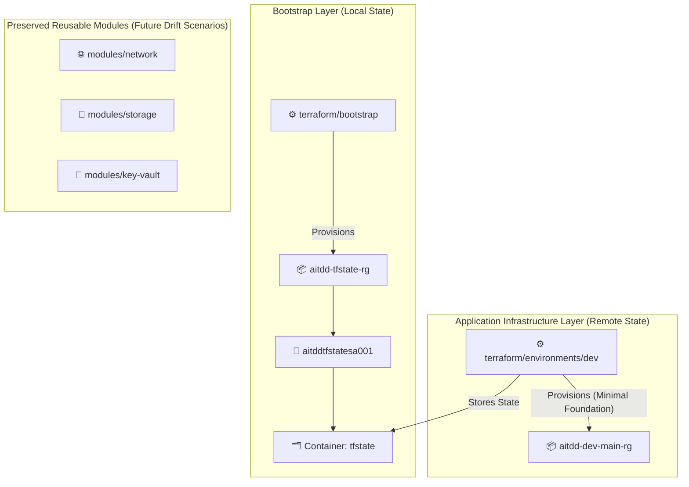

# AI-Powered Terraform Drift Detection & Remediation Platform

> Detect, analyze, and remediate infrastructure drift in Azure using Terraform, Python, LangGraph, and GitHub automation.

---

## 📌 Current Phase

**Phase 2 — Remote Terraform State & Secure Azure Authentication** ✅ Complete

This phase established a dedicated, secure Azure Storage remote backend for Terraform state and GitHub Actions OIDC (Workload Identity) authentication. The state backend and the `dev` baseline Resource Group are deployed to Azure, the `dev` environment's state lives in the remote `dev.tfstate` blob, and a GitHub Actions run has authenticated to Azure via OIDC and completed `terraform plan` with no long-lived credentials. CI is **plan-only**.

---

## 🎯 Project Overview

Infrastructure drift — the divergence between Terraform state and actual Azure resources — is a common and dangerous problem. Manual changes, failed deployments, and policy overrides silently introduce configuration gaps that can lead to security vulnerabilities, compliance violations, and outages.

This platform will provide:

- **Automated drift detection** via scheduled Terraform plans
- **AI-powered analysis** of drift causes using LangGraph + LLM
- **Azure Activity Log investigation** to identify who/what caused drift
- **GitHub Issue/PR automation** for tracking and remediation
- **Human-in-the-loop approval** before any automated remediation
- **Professional dashboard** for visibility

---

## 🏗️ Architecture



> See [docs/architecture.md](docs/architecture.md) for detailed design decisions, security controls, and OIDC flow diagrams.

---

## 🛠️ Technology Stack (Phases 1 & 2)

| Technology | Version | Purpose |
|---|---|---|
| Terraform | >= 1.6.0 | Infrastructure as Code |
| AzureRM Provider | ~> 5.0 | Azure resource management |
| Azure CLI | >= 2.x | Local developer authentication |
| GitHub Actions | `actions/checkout@v4`, `azure/login@v3`, `hashicorp/setup-terraform@v3` | CI/CD & OIDC authentication test |
| Terraform in CI | 1.14.7 (pinned) | Matches the version that wrote the remote state |

---

## ☁️ Azure Infrastructure Resources

### Remote State Storage (Phase 2 Bootstrap)

| Resource | Name | Location | Purpose |
|---|---|---|---|
| Resource Group | `aitdd-tfstate-rg` | `Central India` | Dedicated state storage RG |
| Storage Account | `aitddtfstatesa001` | `Central India` | Encrypted, versioned state storage |
| Blob Container | `tfstate` | N/A | Private container for `.tfstate` files |
| State Blob | `dev.tfstate` | N/A | Remote state for the `dev` environment |

### Application Infrastructure (Phase 1 Dev — Minimal Foundation)

| Resource | Name Pattern | Status | Location | Purpose |
|---|---|---|---|---|
| Resource Group | `aitdd-dev-main-rg` | Active Baseline | `Central India` | Application dev environment RG baseline |
| Virtual Network | `aitdd-dev-main-vnet` | Module Preserved | Deferred | Deferred to future multi-resource drift scenarios |
| Subnet | `aitdd-dev-app-snet` | Module Preserved | Deferred | Deferred to future multi-resource drift scenarios |
| NSG | `aitdd-dev-app-nsg` | Module Preserved | Deferred | Deferred to future security drift scenarios |
| Storage Account | `aitdddevsa001` | Module Preserved | Deferred | Deferred to future drift scenarios |
| Key Vault | `aitdd-dev-kv-001` | Module Preserved | Deferred | Deferred to future secrets/RBAC drift scenarios |

---

## 📁 Repository Structure

```
.github/
└── workflows/
    └── terraform-auth-test.yml     # OIDC authentication & plan workflow

terraform/
├── bootstrap/                      # Bootstrap module (Local state)
│   ├── versions.tf
│   ├── providers.tf
│   ├── variables.tf
│   ├── main.tf
│   └── outputs.tf
│
├── modules/                        # Reusable, for_each-driven modules
│   ├── resource-group/
│   ├── network/
│   ├── storage/
│   └── key-vault/
│
└── environments/
    └── dev/                        # Dev environment (Remote state)
        ├── versions.tf
        ├── providers.tf
        ├── backend.tf              # AzureRM remote backend configuration
        ├── variables.tf
        ├── main.tf
        ├── outputs.tf
        └── dev.tfvars
```

---

## 🚀 Deployment & Operations Guide

### 1. Authenticate with Azure Locally

```bash
az login
az account set --subscription "<your-subscription-id>"
```

### 2. Provision the Remote State Backend (Bootstrap)

The backend storage must be created before configuring the environment's remote backend:

```bash
cd terraform/bootstrap
terraform init
terraform plan
# Apply bootstrap after reviewing plan (requires user approval):
terraform apply
```

### 3. Initialize Dev Environment with State Migration

Once the bootstrap storage account is provisioned:

```bash
cd terraform/environments/dev

# Initialize backend and migrate existing state if applicable:
terraform init -migrate-state

# Validate & Plan:
terraform validate
terraform plan -var-file="dev.tfvars"
```

---

## 🔐 GitHub Actions OIDC Authentication Setup

This project uses **GitHub OIDC / Azure Federated Identity Credentials**. No long-lived
client secret, certificate, or storage account access key is used anywhere — the app
registration holds zero credentials.

### Azure Setup Steps

1. **Create the Entra App Registration & Service Principal** (this project uses
   `aitdd-github-oidc`):
   ```bash
   az ad app create --display-name "aitdd-github-oidc" --sign-in-audience AzureADMyOrg
   az ad sp create --id "<app-id>"
   ```

2. **Add the Federated Identity Credential** linking the repository's `main` branch to
   Entra ID:
   - **Issuer**: `https://token.actions.githubusercontent.com`
   - **Audience**: `api://AzureADTokenExchange`
   - **Subject identifier**: must match GitHub's `sub` claim **exactly** — Entra does not
     support wildcards, and a mismatch fails the token exchange *silently, with no error*.

   > **Pick the right subject format.** Repositories created **after 2026-07-15** use
   > GitHub's **immutable** subject format, which embeds numeric owner and repository IDs:
   >
   > ```
   > repo:OWNER@OWNER-ID/REPO@REPO-ID:ref:refs/heads/main
   > ```
   >
   > Older repositories use the legacy form `repo:OWNER/REPO:ref:refs/heads/main`.
   > This repository was created after the cutoff and therefore uses the immutable
   > format. Retrieve the two IDs from
   > `https://api.github.com/repos/<owner>/<repo>` (`owner.id` and `id`).

3. **Assign least-privilege Azure RBAC** — exactly these two, and nothing more:
   - `Reader` at **subscription** scope — read-only metadata for `terraform plan`
   - `Storage Blob Data Contributor` scoped to the **`tfstate` container** (not the
     storage account, not the subscription)

   `Contributor` is **not** assigned. CI is plan-only; see
   [Security Principles](#-security-principles).

   > Creating role assignments requires **Owner** or **User Access Administrator**.
   > A `Contributor` account cannot create them.

4. **Add GitHub repository secrets** under *Settings → Secrets and variables → Actions*:
   - `AZURE_CLIENT_ID` — the App Registration's Application (client) ID
   - `AZURE_TENANT_ID`
   - `AZURE_SUBSCRIPTION_ID`

   These are referenced by the workflow as `${{ secrets.* }}`; their values are
   intentionally not recorded in this repository.

5. **Verify** by running the `terraform-auth-test.yml` workflow. A green run proves the
   federated credential, the secrets, and the RBAC scopes are all correct together.

---

## 🔒 Security Principles

| Principle | Implementation |
|---|---|
| Backend Isolation | State storage is separated from app storage. |
| No Committed Secrets | Credentials, tokens, and state files are gitignored. |
| OIDC Authentication | Workload Identity replaces static Azure client secrets in GitHub Actions. |
| State Security | State blob versioning enabled; container set to private. |
| Least Privilege | Exactly two RBAC assignments on the CI identity: `Reader` (subscription) and `Storage Blob Data Contributor` (`tfstate` container). No `Contributor`, `Owner`, or `User Access Administrator`. |
| Plan-Only CI | GitHub Actions has **no autonomous `terraform apply` capability**, enforced by RBAC rather than convention — the identity holds no write actions. Any future remediation/apply capability would require explicit human approval. |
| No Storage Account Keys | `listkeys` is denied to the CI identity, so state access uses Entra ID on the data plane (`ARM_USE_AZUREAD=true`) instead of account keys. |

---

## 🗺️ Project Roadmap

| Phase | Description | Status |
|---|---|---|
| 1 | Terraform + Azure Foundation (Minimal Baseline) | ✅ Complete |
| 2 | Remote state backend + secure auth (plan-only CI) | ✅ Complete |
| **3** | **Deterministic Terraform drift detection** | 🟡 Next |
| 4 | Python drift parser | ⬜ Planned |
| 5 | Scheduled GitHub Actions drift detection | ⬜ Planned |
| 6 | LangGraph AI analysis | ⬜ Planned |
| 7 | Azure Activity Log investigation | ⬜ Planned |
| 8 | GitHub Issue/PR automation | ⬜ Planned |
| 9 | DevSecOps scanning | ⬜ Planned |
| 10 | FinOps / Infracost | ⬜ Planned |
| 11 | Human-approved remediation | ⬜ Planned |
| 12 | Testing and hardening | ⬜ Planned |
| 13 | Professional dashboard | ⬜ Planned |
| 14 | Final documentation / demo | ⬜ Planned |

---

## 📄 License

This project is licensed under the [MIT License](LICENSE).
