# Master Project Guide — AI Terraform Drift Detector

> **Who this is for:** me, the project owner. Not the coding agent.
> **What it is:** a personal handbook and roadmap. It explains the whole project from zero,
> shows where the project is today, and what comes next.
>
> **Snapshot history:**
> - **Originally written** against the historical commit `3e2a696` (2026-10-01, during
>   Phase 3). That commit is *not* the current project HEAD.
> - **Last updated** against commit `fae5782` (2026-10-03: Phase 9 in progress, Task 9.2
>   complete, Task 9.3 next). Statuses, roadmap, security, testing and open questions
>   reflect that state.
> - Sections 5–11 still explain Phases 1–3 the way they were designed, with their final
>   status. Phases 4–9 are summarized in [Section 4](#what-phases-49-delivered).
> - For anything newer, `PROJECT_PLAN.md` wins.
>
> **Authoritative sources** (this guide summarizes them and never overrides them):
> - [`PROJECT_PLAN.md`](../PROJECT_PLAN.md): official task list and statuses
> - [`drift-detection-spec.md`](drift-detection-spec.md): official drift-detection rules
> - [`architecture.md`](architecture.md): infrastructure, security and CI-access design
>
> If this guide and `PROJECT_PLAN.md` ever disagree, **`PROJECT_PLAN.md` wins.**

**Status labels used in this guide**

| Label | Meaning |
|---|---|
| 🟢 **CURRENT / DONE** | Built, tested, committed |
| 🟡 **IN PROGRESS** | Partly done |
| ⬜ **FUTURE** | Planned in `PROJECT_PLAN.md`, not built yet |
| ⏸️ **DEFERRED** | Deliberately left out of the current scope (may return in a later phase) |

---

## Table of Contents

1. [Project Overview](#1-project-overview)
2. [The Core Idea — Configuration vs State vs Actual](#2-the-core-idea--configuration-vs-state-vs-actual)
3. [Complete Project Architecture](#3-complete-project-architecture)
4. [Phase-by-Phase Roadmap](#4-phase-by-phase-roadmap)
5. [Phase 1 — Minimal Terraform Foundation](#5-phase-1--minimal-terraform-foundation)
6. [Phase 2 — Remote State & Secure Authentication](#6-phase-2--remote-state--secure-authentication)
7. [Phase 3 — Deterministic Drift Detection](#7-phase-3--deterministic-drift-detection)
8. [Task 3.3 vs Task 3.4 — Where the Boundary Is](#8-task-33-vs-task-34--where-the-boundary-is)
9. [Drift Classification Matrix](#9-drift-classification-matrix)
10. [Resource-Level vs Attribute-Level](#10-resource-level-vs-attribute-level)
11. [Terraform Evidence](#11-terraform-evidence)
12. [Testing Strategy](#12-testing-strategy)
13. [Security Design](#13-security-design)
14. [Git / Development Workflow](#14-git--development-workflow)
15. [Current Project Status — One Screen Summary](#15-current-project-status--one-screen-summary)
16. [If I Understand Only 10 Things](#16-if-i-understand-only-10-things-they-should-be-these)
17. [Glossary](#17-glossary)
18. [Known Ambiguities & Open Questions](#18-known-ambiguities--open-questions)

---

## 1. Project Overview

### What is the AI Terraform Drift Detector?

It is a platform that **notices when my Azure infrastructure no longer matches my Terraform
code**, explains what changed, and, in later phases, helps me fix it safely with human
approval.

The official name in `PROJECT_PLAN.md` is the *AI-Powered Terraform Drift Detection &
Remediation Platform*.

### What problem does it solve?

I describe my infrastructure in Terraform code. But Azure can still be changed **outside**
Terraform: someone clicks in the Azure Portal, runs an Azure CLI command, or a script
changes a setting. Terraform does not automatically know this happened.

That gap between "what I declared" and "what really exists" is called **drift**. Drift is
risky:

- A security setting can be silently weakened.
- Costs can change without anyone noticing.
- The next `terraform apply` can unexpectedly undo someone's change, or fail.

### Why does drift happen?

| Cause | Example |
|---|---|
| Manual change in the Azure Portal | Someone adds a tag to the Resource Group by hand |
| Azure CLI / script change | A script deletes a resource Terraform created |
| Azure itself changes a value | Azure normalizes or computes a value |
| Provider changes | A newer Terraform provider reads a value differently |

The project **does not assume a person did it.** It only reports *what* differs. *Who* did
it is a separate, later phase (Phase 7).

### What does "drift" mean in this project?

In this project, drift has a precise meaning:

> **Drift = the real Azure object is different from what Terraform last recorded in its state.**

Terraform reports this in its plan output in a field called `resource_drift`. If that list
is empty, Terraform saw no drift. If it has entries, drift exists.

A plan that *wants to change something* is **not automatically drift**. It could simply be
that I edited my own Terraform code. Section 2 explains this. It is the most important idea
in the project.

### The four "things" to keep apart

| Thing | Simple meaning | Where it lives in this project |
|---|---|---|
| **Terraform configuration** | What I **want** | `.tf` files and `dev.tfvars` in `terraform/environments/dev/` |
| **Terraform state** | What Terraform **remembers** creating last time | Remote blob `dev.tfstate` in Azure Storage |
| **Azure actual infrastructure** | What **really exists** right now | Azure itself (`aitdd-dev-main-rg` and, since Phase 5A, its VNet, subnet and NSG in Central India) |
| **Terraform evidence** | A **machine-readable record** of how the three compare | `plan.json` + `detection_run.json` + `plan.log` |

### What will the final system eventually do?

According to `PROJECT_PLAN.md` (Phases 1–14), the finished platform should:

1. **Detect** drift deterministically with Terraform. *(Phase 3, done)*
2. **Package** the results as a typed Python engine with a JSON report. *(Phase 4, done)*
3. **Run on a schedule** in GitHub Actions. *(Phase 5, done)*
4. **Explain** drift with AI (LangGraph), without letting AI decide whether drift exists. *(Phase 6, done as a library; CLI/CI integration is Phase 9A)*
5. **Find who/what made the change** from Azure Activity Logs. *(Phase 7, done; opt-in, not in any workflow)*
6. **Open GitHub Issues** automatically and close them on evidence. *(Phase 8, done. Remediation PRs moved to Phase 11)*
7. Add **security scanning** *(Phase 9, in progress: TFLint and Trivy config done)* and **cost analysis** *(Phase 10, future)*.
8. **Fix drift only with human approval.** *(Phase 11, future)*
9. Show everything on a **dashboard** with real data. *(Phase 13, future)*

### Big-picture diagram

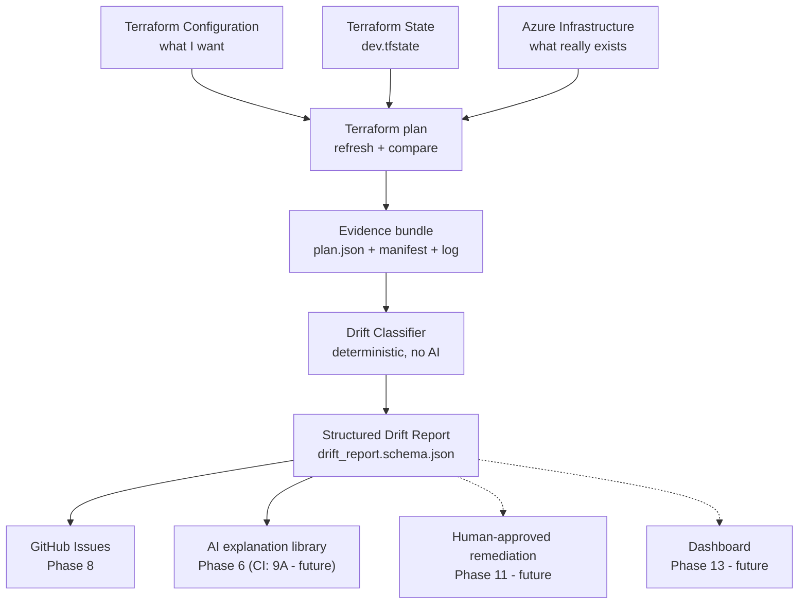

Solid lines = **built today**. Dotted lines = **future**.

---

## 2. The Core Idea — Configuration vs State vs Actual

### The three views

Terraform's plan compares **three views** of every resource:

```text
Terraform Configuration          (D = Desired)
        |
        |  What I WANT
        v
Terraform State                  (S = State)
        |
        |  What Terraform REMEMBERS from last time
        v
Azure Actual                     (R = Real / refreshed)
        |
        |  What REALLY EXISTS right now
```

The spec uses the letters **S**, **R** and **D**. The rest of this guide uses them too.

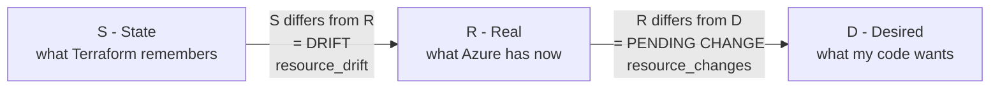

**Two comparisons, two different meanings:**

| Comparison | Terraform field | Meaning |
|---|---|---|
| **S vs R** | `resource_drift` | Something outside this plan changed the real object → **drift** |
| **R vs D** | `resource_changes` | What Terraform would do now to make Azure match my code → **pending change** |

### How Terraform gets these views

When I run `terraform plan`:

1. Terraform reads its **state** (S).
2. It **refreshes**, asking Azure "what does this resource look like now?" That gives R.
3. It reads my **configuration** (D).
4. It reports `resource_drift` (S vs R) and `resource_changes` (R vs D).

Everything below uses the one real resource in this project: the Resource Group
`aitdd-dev-main-rg`. Its current tags are:

```text
environment = dev
managed_by  = terraform
project     = ai-terraform-drift-detector
```

### Case A — Everything matches

```text
Configuration (D) = State (S) = Actual (R)
```

- Nobody changed Azure. I did not change my code.
- `resource_drift`: empty. `resource_changes`: `no-op`.
- `terraform plan` exit code: `0`.

**Result:** `in_sync`

### Case B — Azure changed outside Terraform

Someone adds a tag `owner = alice` to the Resource Group in the Azure Portal.

```text
D = S  (my code and Terraform's memory agree: 3 tags)
R ≠ S  (Azure now has 4 tags)
```

- `resource_drift` lists the Resource Group: the **tags** changed outside Terraform.
- `resource_changes` says `update`: Terraform would **remove** the extra tag to match my code.
- Exit code: `2`.

**Result:** `external_drift`. The attribute `tags` is `drifted`.

### Case C — I changed my Terraform configuration

I add `extra_tags = { owner = "alice" }` to `dev.tfvars`. Nobody touched Azure.

```text
S = R  (Azure still matches what Terraform remembers)
D ≠ S  (my code now wants a 4th tag)
```

- `resource_drift`: **empty**, so nothing changed outside Terraform.
- `resource_changes` says `update`: Terraform would **add** the tag.
- Exit code: `2`, **the same as Case B**.

**Result:** `config_change`. This is **not** drift.

> ⚠️ **Why this matters:** Cases B and C both return exit code `2` and both show an `update`.
> If I only looked at the exit code, I would wrongly call my own code change "drift".
> **Only `resource_drift` tells them apart.** This was proven with real Terraform in Task 3.1.

### Case D — Drift and a configuration change at the same time

Someone sets tag `probe = 1` in Azure, and I separately set `probe = 2` in my code.

```text
S: no probe tag     R: probe = 1     D: probe = 2
```

- Drift exists, because S differs from R.
- My code also changed, because D differs from both S and R.
- Terraform alone **cannot know** which change was "intended".

**Result:** `drift_and_config_change`, marked **`ambiguous: true`**. The project reports
both sides and does **not** guess.

### Case E — Converged drift (the sneaky one)

Someone adds tag `owner = alice` in Azure, and I *also* add exactly the same tag to my code.

```text
S: 3 tags     R: 4 tags     D: 4 tags (same as R)
```

- Drift exists, because S differs from R.
- But Azure already matches my code, so Terraform has **nothing to do**.
- Exit code: **`0`**, the same as "everything matches"!

**Result:** `converged_drift`. Drift really happened, even though exit code `0` suggests
otherwise. This is why the project **never** uses the exit code alone to decide drift.

> Note: this only proves the current state differs from what Terraform remembered. It
> does **not** prove when, how or by whom the change happened.

---

## 3. Complete Project Architecture

### End-to-end flow

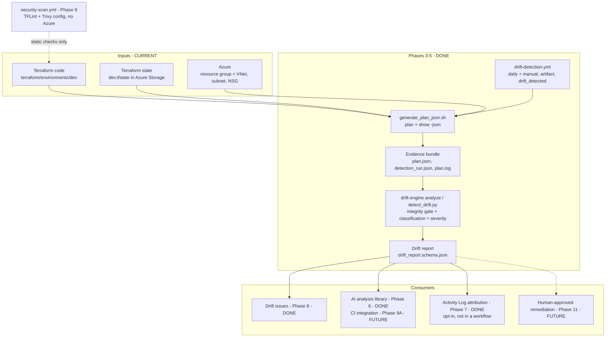

The real task dependencies are in the [Phase-by-Phase Roadmap](#4-phase-by-phase-roadmap).

### What is CURRENT, FUTURE and DEFERRED

| Component | State | Where |
|---|---|---|
| Resource Group `aitdd-dev-main-rg` | 🟢 CURRENT | `terraform/modules/resource-group`, `terraform/environments/dev` |
| VNet, Subnet, NSG, Subnet–NSG association | 🟢 CURRENT (Phase 5A) | `terraform/modules/network` |
| Remote state (`aitdd-tfstate-rg` / `aitddtfstatesa001` / `tfstate`) | 🟢 CURRENT (`prevent_destroy` since Task 9.1) | `terraform/bootstrap` |
| GitHub Actions OIDC login + plan-only CI | 🟢 CURRENT | `.github/workflows/terraform-auth-test.yml` |
| Drift-detection specification | 🟢 CURRENT | `docs/drift-detection-spec.md` |
| Evidence generation, classification, values, nested diffs, report schema | 🟢 CURRENT (Phase 3) | `scripts/`, `schemas/` |
| Real external Azure drift tests | 🟢 CURRENT (Tasks 3.6–3.7) | `tests/scenarios/` |
| Python drift engine + severity | 🟢 CURRENT (Phase 4) | `src/drift_engine/` |
| Scheduled drift-detection workflow | 🟢 CURRENT (Phase 5) | `.github/workflows/drift-detection.yml` |
| AI analysis engine (library) | 🟢 CURRENT (Phase 6) | `src/ai_engine/` |
| Activity Log collector + attribution | 🟢 CURRENT (Phase 7, opt-in) | `src/drift_engine/activity_logs.py`, `attribution.py` |
| Drift issues (create/update/close) | 🟢 CURRENT (Tasks 8.1, 8.3) | `scripts/github_automation.py` |
| TFLint + Trivy config scanning | 🟢 CURRENT (Tasks 9.1, 9.2) | `.github/workflows/security-scan.yml` |
| TruffleHog, Super-Linter | ⬜ FUTURE (Tasks 9.3, 9.4) | — |
| AI CLI + CI, cost, remediation, hardening, dashboard | ⬜ FUTURE (Phases 9A–14) | — |
| Remediation PRs (old Task 8.2) | ⬜ FUTURE (moved to Phase 11) | — |
| Application Storage Account, Key Vault | ⏸️ DEFERRED | Not in the codebase |

---

## 4. Phase-by-Phase Roadmap

All names and statuses below are taken from `PROJECT_PLAN.md`.
**Phases completed: 8 of 14**, as reported by `PROJECT_PLAN.md`.

That figure counts the numbered phases 1–14. The lettered phases are planned separately:
- **Phase 5A** (Dev Infrastructure Expansion) is a completed expansion phase after Phase 5
  (the plan places it before Phase 6). It wasn't skipped; it just isn't counted in "8 of 14".
- **Phase 9A** (AI Analysis Integration) is planned and not started, placed before Phase 10.

| Phase | Name (from `PROJECT_PLAN.md`) | Main goal in simple words | Status |
|---|---|---|---|
| 1 | Minimal Terraform Foundation | One Terraform-managed Resource Group as a clean baseline | 🟢 COMPLETED |
| 2 | Remote State & Secure Azure Authentication | Store state safely in Azure; let GitHub log in to Azure without passwords | 🟢 COMPLETED |
| 3 | Deterministic Terraform Drift Detection | Detect and classify drift with Terraform only, no AI | 🟢 COMPLETED |
| 4 | Python Drift Engine | Turn detection into a proper Python package with typed models and output formats | 🟢 COMPLETED |
| 5 | Automated Drift Detection Workflow | Run detection automatically in GitHub Actions (schedule + manual) | 🟢 COMPLETED |
| 5A | Dev Infrastructure Expansion | VNet, Subnet, NSG next to the Resource Group | 🟢 COMPLETED |
| 6 | LangGraph AI Analysis Engine | AI explains drift (security, cost, risk, remediation) from evidence | 🟢 COMPLETED |
| 7 | Azure Activity Log Investigation | Find which Azure operation/caller made the change | 🟢 COMPLETED |
| 8 | GitHub Issue / PR Automation | Open/close drift issues automatically (remediation PRs moved to Phase 11) | 🟢 COMPLETED |
| 9 | DevSecOps Integration | TFLint, Trivy config, TruffleHog, Super-Linter in CI | 🟡 WORK IN PROGRESS (9.1, 9.2 done; 9.3 next) |
| 9A | AI Analysis Integration | AI analysis CLI and no-LLM CI integration | ⬜ NOT STARTED |
| 10 | FinOps / Cost Analysis | Infracost cost deltas + AI cost explanation | ⬜ NOT STARTED |
| 11 | Human-Approved Remediation | Apply fixes only after human approval | ⬜ NOT STARTED |
| 12 | Testing & Security Hardening | Full test suite, scenario matrix, security audit | ⬜ NOT STARTED |
| 13 | Professional Dashboard | API + UI showing real drift data | ⬜ NOT STARTED |
| 14 | Final Documentation, Demo & Portfolio Assets | Final docs, demo script, portfolio summary | ⬜ NOT STARTED |

> **About Phases 9A–14 and Tasks 9.3–9.4:** each has a drafted task list in
> `PROJECT_PLAN.md`. They are **future scope, not yet finalized**: every task gets its own
> design review before implementation, and reviews have changed tasks before. For example,
> tfsec was replaced by Trivy in 9.2, and the remediation PRs of 8.2 moved to Phase 11.

### Roadmap diagram (main dependencies from `PROJECT_PLAN.md`)

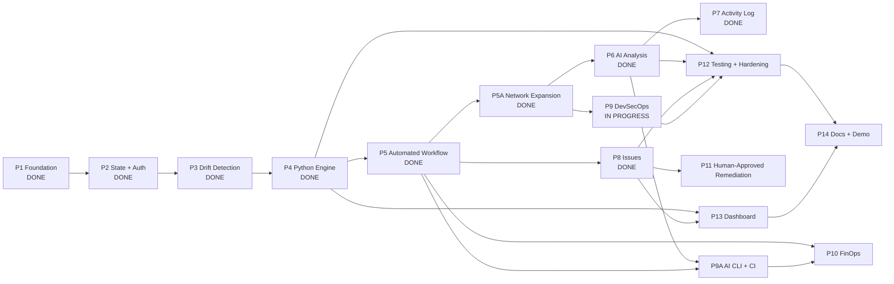

### What Phases 4–9 delivered

| Phase | What was built (details and evidence: `PROJECT_PLAN.md`) |
|---|---|
| **4 — Python Drift Engine** | `src/drift_engine/`: the Phase 3 code was **moved into** the package (not rewritten), plus strict Pydantic models, the configured/noise comparator, deterministic `CRITICAL`…`INFO` severity and `drift-engine analyze` (JSON, YAML, console). |
| **5 — Automated Workflow** | `drift-detection.yml`: daily 02:00 UTC + manual, `main` only, OIDC. It publishes the redacted report + manifest as `drift-report-<run_id>` and a `drift_detected` output (`true` / `false` / `unknown`). Raw plan evidence never leaves the runner. |
| **5A — Network Expansion** | VNet, subnet, NSG (empty rule set, so out-of-band rules show as drift) and the subnet–NSG association, applied with approval and verified in sync. |
| **6 — AI Analysis** | `src/ai_engine/`: a LangGraph pipeline over the drift report (security, cost/configuration, root cause/risk, remediation options, JSON + Markdown report). The LLM is opt-in (`AI_LLM_PROVIDER=none` by default). AI output is checked against the evidence and never changes drift or severity. It is a library only; CLI/CI is Phase 9A. |
| **7 — Activity Log** | `drift-engine activity-logs` (opt-in `[azure]` extra) and `drift-engine attribute`: a caller is recorded only where exact-resource write/delete events establish it, otherwise "unknown". Tested with fake log sources; not in any workflow. |
| **8 — Issues** | One public, structure-only issue per drifted resource (8.1), closed only when a newer valid run shows the resource no longer drifted (8.3). Both validated in real runs. Remediation PRs (8.2) were found unsafe for a public repo and moved to Phase 11. |
| **9 — DevSecOps** (in progress) | `security-scan.yml`, no Azure access. **TFLint** (9.1) checks lint and value validity; **Trivy config** (9.2) checks security policy, with HIGH/CRITICAL blocking except one expiring, script-enforced risk acceptance (AZU-0012 on the state storage account, until 2027-03-31). TruffleHog (9.3) and Super-Linter (9.4) are next, each after a design review. |

---

## 5. Phase 1 — Minimal Terraform Foundation

**Status: 🟢 COMPLETED** (5 of 5 tasks)

### Why Phase 1 exists

Before I can detect drift, I need something that Terraform **manages** and that I can
later change on purpose. Phase 1 builds that baseline.

### What is included

The MVP intentionally contains **exactly one** Azure resource:

```text
aitdd-dev-main-rg
Central India
tags: environment=dev, managed_by=terraform, project=ai-terraform-drift-detector
```

Terraform address: `module.resource_group.azurerm_resource_group.this["main"]`

### What is deferred ⏸️

| Resource | Status |
|---|---|
| Virtual Network (VNet) | ⏸️ Deferred in Phase 1 → 🟢 added in Phase 5A |
| Subnet | ⏸️ Deferred in Phase 1 → 🟢 added in Phase 5A |
| Network Security Group (NSG) | ⏸️ Deferred in Phase 1 → 🟢 added in Phase 5A |
| Application Storage Account | ⏸️ Deferred |
| Key Vault | ⏸️ Deferred |
| Any other application resource | ⏸️ Deferred |

The network resources live in `terraform/modules/network/`. The application Storage
Account and Key Vault are still not in the codebase.

### Why keep it this small?

- **The goal is drift detection, not building infrastructure.** One resource is enough to
  prove the whole detect → classify → explain → fix lifecycle.
- **Fewer moving parts:** fewer costs, permissions and failure points.
- **Clear results:** with one resource, every test result is easy to read and verify.
- More resources can be added in a later "infrastructure expansion" phase, *after* the
  core workflow is proven (`PROJECT_PLAN.md`, Phase 1 scope note).

### How it is built

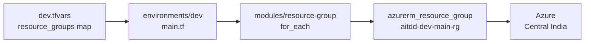

- **`for_each` pattern:** Resource Groups come from a map in `dev.tfvars`. Adding one later
  means adding a map entry, with no new code.
- **Name pattern:** `<project>-<env>-<name>-rg` → `aitdd-dev-main-rg`.
- **Important trap:** `dev.tfvars` is **mandatory**. Without it, `resource_groups` is
  empty, and a plan would declare zero resources (a false "all good").

### Phase 1 tasks

| Task | What it does | Status |
|---|---|---|
| 1.1 | Resource Group module with tag merging | 🟢 |
| 1.2 | Data-driven `for_each` variables (`map(object(...))`) | 🟢 |
| 1.3 | Dev environment: `aitdd-dev-main-rg` in Central India | 🟢 |
| 1.4 | `scripts/validate.sh`: offline fmt + validate, no Azure login | 🟢 |
| 1.5 | README + architecture docs | 🟢 |

### The baseline

After Phase 2 deployed it (Task 2.4a) and verified it (Task 2.5):

```text
Configuration = State = Actual      →  terraform plan exit 0, resource_drift empty
```

This **zero-drift baseline** is the reference point for everything in Phase 3.

### How this becomes the drift test scenario

The planned MVP drift test (Phase 3, Tasks 3.6–3.7):

1. Start from the baseline (in sync).
2. Change a mutable property of `aitdd-dev-main-rg` **outside Terraform** (candidate:
   tags) using the Azure CLI.
3. Run detection → expect `external_drift` with `tags` = `drifted`.
4. Revert the change → back to `in_sync`.

Task 3.1 first proved this by **simulation**. On 2026-10-02 the real change was made
with my approval (Tasks 3.6–3.7): the tag `aitdd_drift_probe` was added with the Azure CLI,
detected as `external_drift` with exactly `tags.aitdd_drift_probe` = `drifted`, and then
reverted (18/18 checks).

---

## 6. Phase 2 — Remote State & Secure Authentication

**Status: 🟢 COMPLETED** (10 of 10 tasks, including inserted tasks 2.4a and 2.5a)

### The pieces and why each exists

| Piece | What it is | Why it exists |
|---|---|---|
| **Bootstrap** (`terraform/bootstrap`) | A small separate Terraform config that creates the state storage | Chicken-and-egg: remote state needs storage *before* Terraform can use it. Bootstrap keeps its **own local state** for that reason. |
| **Remote Terraform state** | State stored in Azure instead of on my laptop | Shared, durable, versioned, lockable; GitHub Actions can read it |
| **Azure Storage Account** `aitddtfstatesa001` | Holds the state blob | HTTPS only, TLS 1.2, no public blob access, blob versioning, 7-day soft delete |
| **State container** `tfstate` | Private blob container | The dev state file is the blob `dev.tfstate` |
| **AzureRM backend** (`backend.tf`) | Tells Terraform where the state lives | Points `dev` at `aitdd-tfstate-rg` / `aitddtfstatesa001` / `tfstate` / `dev.tfstate` |
| **State migration** (Task 2.4) | Moving local state into the remote backend | In practice there was **no local state** to move: the backend started as an empty remote state, and Task 2.4a then deployed the Resource Group through it |
| **GitHub Actions OIDC** | GitHub gets a short-lived token instead of a stored password | No long-lived secret anywhere |
| **Microsoft Entra ID** | Azure's identity service | Hosts the app registration `aitdd-github-oidc`, which trusts GitHub's token for the `main` branch only |
| **RBAC** | Azure permissions | Exactly 2 roles, least privilege, **plan-only** (see below) |

### Authentication and state architecture

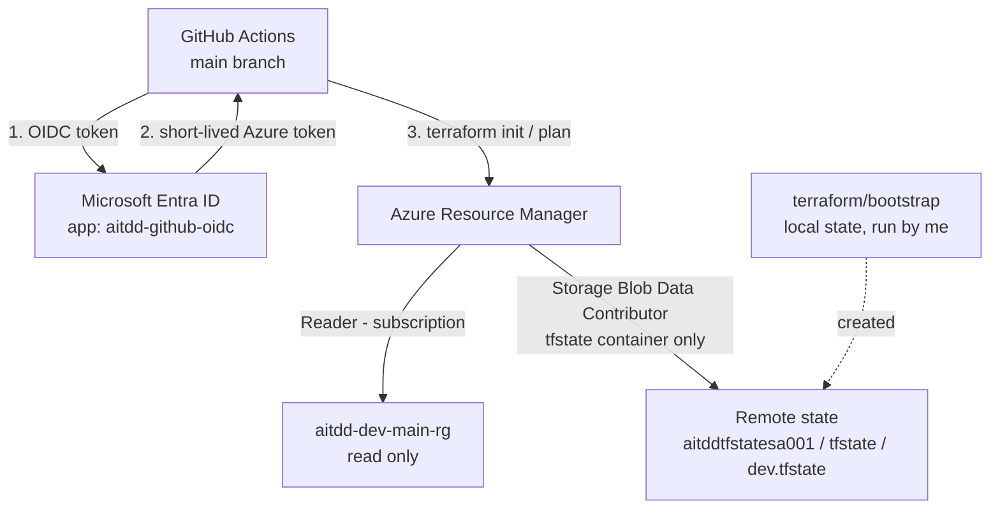

Simple version:

```text
GitHub Actions
      |
      | OIDC (no password)
      v
Microsoft Entra ID  (aitdd-github-oidc)
      |
      | RBAC: Reader + Storage Blob Data Contributor
      v
Azure
      |
      +---- State Storage   (read/write/lock the state blob)
      |
      +---- Application Resources   (READ ONLY - plan, never apply)
```

### Why "plan-only" CI matters

The GitHub identity can **read** everything and **write only the state blob**. It cannot
create, change or delete Azure resources, and it cannot read storage account keys. This
is enforced by Azure permissions, not just by convention. So CI **cannot** run
`terraform apply` even by accident. Applying changes is reserved for future,
human-approved remediation (Phase 11).

### Phase 2 tasks

| Task | What it does | Why it matters | Status |
|---|---|---|---|
| 2.1 | Validate bootstrap config offline | Catch errors before touching Azure | 🟢 |
| 2.2 | Deploy state infrastructure (RG, storage account, container) | Somewhere safe to keep state | 🟢 |
| 2.3 | Verify `backend.tf` points at that storage | Wrong backend = wrong state | 🟢 |
| 2.4 | Initialize remote state for `dev` (no local state existed) | State lives in Azure from the start | 🟢 |
| 2.4a | Deploy `aitdd-dev-main-rg` through the remote backend (approved apply) | Creates the real resource drift detection needs | 🟢 |
| 2.5 | Plan shows zero changes against remote state | Proves the zero-drift baseline | 🟢 |
| 2.5a | Create Git repo + GitHub remote | OIDC trust is bound to a specific repo | 🟢 |
| 2.6 | Configure OIDC; green workflow run | CI can log in without secrets | 🟢 |
| 2.7 | Audit RBAC (read-only) | Confirms least privilege; CI cannot apply | 🟢 |
| 2.8 | Phase 2 documentation | README + architecture match reality | 🟢 |

**What CI actually runs today:**
- `terraform-auth-test.yml`: OIDC login, an Azure context check, `terraform fmt -check`,
  offline bootstrap validation, and dev `init` + `validate` + `plan`.
- `drift-detection.yml` (Phase 5): the Phase 3 scripts and `drift-engine analyze`, daily
  and on demand, plus the drift issues job (Phase 8).
- `security-scan.yml` (Phase 9): TFLint and Trivy config, with no Azure access at all.

---

## 7. Phase 3 — Deterministic Drift Detection

**Status: 🟢 COMPLETED** (7 of 7 tasks, 2026-10-01 to 2026-10-02). The task descriptions
below are kept as the plan for each task, with their final status.

"Deterministic" means: **the same input always gives the same output**, by fixed rules,
with no AI and no guessing.

### Phase 3 flow

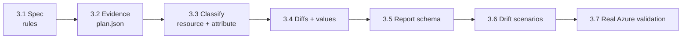

### Phase 3 task summary

| Task | Name | Depends on | Status | Main file(s) |
|---|---|---|---|---|
| 3.1 | Drift Detection Strategy & Execution Plan | 2.8 | 🟢 | `docs/drift-detection-spec.md` |
| 3.2 | Machine-Readable Terraform Plan Generation | 3.1 | 🟢 | `scripts/generate_plan_json.sh` |
| 3.3 | State vs Infrastructure Change Detection | 3.2 | 🟢 | `scripts/detect_drift.py`, tests, fixtures |
| 3.4 | Resource Identification & Categorization | 3.3 | 🟢 | `scripts/detect_drift.py` |
| 3.5 | Structured Drift Schema Definition | 3.4 | 🟢 | `schemas/drift_report.schema.json` |
| 3.6 | Reproducible Drift Scenarios Suite | 3.5 | 🟢 | `tests/scenarios/` |
| 3.7 | Validation Against Real Azure Drift Scenarios | 3.6 | 🟢 | `scripts/detect_drift.py` |

---

### Task 3.1 — Drift Detection Strategy & Execution Plan

**In simple words:**
Before writing any detection code, I wrote down the **rules**: exactly which Terraform
commands to run, how to read the results, and what counts as drift. Every rule was
tested on the real Terraform version (1.14.7), not assumed.

**Why we need it:**
Terraform's behaviour has traps. Without written, verified rules, the code would be built
on wrong assumptions. For example, "exit code 2 = drift" is wrong.

**Input:**
The Phase 1–2 setup (dev config, remote state, real Resource Group) and the installed
Terraform 1.14.7.

**Processing:**
Ran a set of read-only experiments (listed in spec §11) on a **scratch copy** of the dev config. The scratch copy
had a local state copy pulled read-only and refreshed against the real Resource Group.
No apply was run and nothing was changed in Azure.

**Output:**
`docs/drift-detection-spec.md`, the official contract. Key findings:

| Finding | Why it matters |
|---|---|
| Config change and drift **both** give exit code 2 | Exit code alone can't detect drift |
| Converged drift gives exit code **0** with drift present | Exit 0 is not proof of "no drift" |
| Output-only changes give exit code 2 | Exit 2 is not proof of drift |
| On errors, Terraform **still writes a plan file** that looks like "no changes" | Failed runs must be rejected explicitly |
| `-refresh=false` hides drift completely | That flag is forbidden |

**Example:**
In the scratch copy, the state was edited to have an extra tag that Azure doesn't have,
and plan was run. Terraform reported `resource_drift` on `tags`, which proves the provider
detects tag drift.

**Files involved:** `docs/drift-detection-spec.md`

**Status:** 🟢 COMPLETED

**Dependency:** Task 2.8

**What this task does NOT do:** no code, no scripts, no real Azure changes. It defines
rules only.

---

### Task 3.2 — Machine-Readable Terraform Plan Generation

**In simple words:**
A script that runs `terraform plan` the **correct, safe way** and saves the result as
JSON, together with a small "receipt" (manifest) of what happened.

**Why we need it:**
Humans read `terraform plan` text, but programs need structured JSON. The script must
also never mistake a failed run for "no drift".

**Input:** the dev Terraform config, remote state, and Azure (read only).

**Processing:**

```text
terraform init
terraform plan  -var-file=dev.tfvars -detailed-exitcode -out=tfplan
                (refresh ON, locking ON, -lock-timeout=120s, never apply)
terraform show -json tfplan  > plan.json      (only if exit code was 0 or 2)
integrity gate: is plan.json valid, complete, error-free, consistent with the exit code?
```

**Output:** an **evidence bundle** in a folder **outside the repository**:

| File | Always? | Content |
|---|---|---|
| `detection_run.json` | ✅ | Manifest: outcome, exit codes, Terraform version, commit, timestamps, run id |
| `plan.log` | ✅ | Terraform's text output (for debugging) |
| `plan.json` | only if plan exit 0 or 2 | Machine-readable plan |
| `tfplan` | transient | Binary plan; not used downstream |

Script exit status: `0` = run succeeded (whether plan exit was 0 or 2), `1` = detection
failed, `64` = bad output folder.

**Example:** on the real dev environment today → `outcome: succeeded`, `plan_exit_code: 0`.

**Files involved:** `scripts/generate_plan_json.sh`

**Status:** 🟢 COMPLETED

**Dependency:** Task 3.1

**What this task does NOT do:** it does **not** decide whether drift exists. It only
produces trustworthy evidence. It is also not wired into GitHub Actions yet (Phase 5).

---

### Task 3.3 — State vs Infrastructure Change Detection

**In simple words:**
A Python script that reads the evidence bundle and answers, for every resource:
**"Did Azure change behind Terraform's back, did my code change, both, or nothing?"**

**Why we need it:**
This is the step that separates **drift** (S vs R) from **configuration changes** (D vs S).
Without it, every plan change would look like drift.

**Input:** the evidence bundle from Task 3.2 (`detection_run.json` + `plan.json`).

**Processing:**

1. Checks the evidence **again** (it never trusts the earlier step).
2. Matches `resource_drift` and `resource_changes` entries by resource address.
3. Assigns a **resource class** (e.g. `external_drift`).
4. For each changed top-level attribute, assigns an **attribute class** (e.g. `tags` =
   `drifted`). It reports names only, no values.
5. Marks unclear cases `ambiguous` / `undetermined` instead of guessing.

**Output:** `drift_classification.json`. Real example (external drift scenario):

```json
{
  "outcome": "succeeded",
  "has_drift": true,
  "resources": [
    {
      "address": "module.resource_group.azurerm_resource_group.this[\"main\"]",
      "type": "azurerm_resource_group",
      "classification": "external_drift",
      "action": "update",
      "drift_action": "update",
      "attributes": [ { "name": "tags", "class": "drifted" } ],
      "ambiguous": false
    }
  ]
}
```

A failed run instead gives `"outcome": "failed", "has_drift": null`, which means
**unknown**, never "no drift".

**Files involved:** `scripts/detect_drift.py`, `tests/test_detect_drift.py`,
`tests/fixtures/plan_evidence/` (11 scenarios)

**Status:** 🟢 COMPLETED

**Dependency:** Task 3.2

**What this task does NOT do:**
- No attribute **values** (before/after). That is Task 3.4.
- No nested diffs (which individual tag key changed). That is Task 3.4.
- No final report format. That is Task 3.5.
- No real Azure changes, no Terraform runs, no Azure or AI calls.
- No "who changed it". That is Phase 7.

---

### Task 3.4 — Resource Identification & Categorization

**In simple words:**
Add the **details** of each change: the actual old and new values of changed attributes,
which part of a nested attribute changed (e.g. which tag key), and group findings by
resource type.

**Why we need it:**
Task 3.3 tells me *that* `tags` drifted. Task 3.4 should tell me *what* changed, e.g.
"tag `owner` was added with value `alice`". Later steps (report schema, AI explanation)
need that detail.

**Input:** `plan.json` (already validated) and the Task 3.3 classification.

**Processing (from `PROJECT_PLAN.md` + spec):** extract `before`/`after` values for changed
attributes, compute finer (nested) diffs, group by resource type (initially
`azurerm_resource_group`), and redact sensitive values.

**Output:** detailed attribute diffs added to the classification result.

**Example:**
`tags`: state `{3 tags}` → Azure `{3 tags + owner=alice}`; nested diff: `owner` **added
outside Terraform**.

**Files involved:** `scripts/detect_drift.py` (per `PROJECT_PLAN.md`)

**Status:** 🟢 COMPLETED (2026-10-02). Per-path `attribute_changes` with recorded/real/desired views (maps descended key by key) and sensitive-value redaction were added to `scripts/detect_drift.py`.

**Dependency:** Task 3.3

**What this task does NOT do:** it should not change the resource/attribute classes from
Task 3.3, define the final JSON schema (3.5), or touch Azure. See
[Section 8](#8-task-33-vs-task-34--where-the-boundary-is).

---

### Task 3.5 — Structured Drift Schema Definition

**In simple words:** write the official JSON format of a drift report as a JSON Schema
file, so every later component (Python engine, AI, GitHub, dashboard) reads the same shape.

**Why we need it:** a fixed contract stops components from breaking each other.

**Input:** Task 3.3/3.4 output.

**Processing:** define the schema: header (timestamp, environment, target), summary counts,
and a detailed resource list (address, type, action, `attribute_changes`).

**Output:** `schemas/drift_report.schema.json` + a validated sample `drift_report.json`.

**Example:** a report saying "1 resource, external_drift, attribute tags", validated
against the schema.

**Files involved:** `schemas/drift_report.schema.json`, `schemas/examples/drift_report.json`

**Status:** 🟢 COMPLETED (2026-10-02)

**Dependency:** Task 3.4

**What this task does NOT do:** no new detection logic and no Azure changes.

---

### Task 3.6 — Reproducible Drift Scenarios Suite

**In simple words:** scripts that **deliberately create** a known drift in Azure (e.g.
change a tag on `aitdd-dev-main-rg`) and scripts that **undo** it.

**Why we need it:** to prove detection works against *real* Azure changes, not only
simulations, and to repeat that proof any time.

**Input:** the dev Resource Group; Azure CLI.

**Processing:** inject drift → run detection → check the expected result → revert.

**Output:** scenario + revert scripts in `tests/scenarios/`.

**Example:** `az` command adds tag `owner=alice` → expect `external_drift` / `tags` →
remove the tag → expect `in_sync`.

**Files involved:** `tests/scenarios/` (`rg_tag_drift_inject.sh`, `rg_tag_drift_revert.sh`, `run_rg_tag_drift_scenario.sh`)

**Status:** 🟢 COMPLETED (2026-10-02; approved real run, 18/18 checks)

**Dependency:** Task 3.5

**What this task does NOT do:** no remediation with `terraform apply`. ⚠️ It **does change
real Azure resources**, so it needs my explicit approval (Execution Rules 10 and 13).

---

### Task 3.7 — Validation Against Real Azure Drift Scenarios

**In simple words:** the final Phase 3 exam. Make a real drift in Azure, run the full
detection, and confirm the report shows exactly the attribute I changed.

**Why we need it:** proves the whole Phase 3 pipeline end to end on real infrastructure.

**Input:** the Task 3.6 scenarios.

**Processing:** introduce drift via Azure CLI → run detection → compare
`drift_report.json` with what I changed → **revert immediately**.

**Output:** verified evidence that real drift is detected correctly.

**Files involved:** `scripts/detect_drift.py`

**Status:** 🟢 COMPLETED (2026-10-02): the report showed exactly the modified attribute, `tags.aitdd_drift_probe` = `drifted`

**Dependency:** Task 3.6

**What this task does NOT do:** no AI, no automation, no remediation. ⚠️ Needs explicit
approval because it changes Azure.

---

## 8. Task 3.3 vs Task 3.4 — Where the Boundary Is

> **Historical analysis**, written before Task 3.4. Task 3.4 was then implemented along
> these lines: values, nested diffs and redaction, with Task 3.3 classes unchanged. Phase 4
> moved the code into `src/drift_engine/` instead of rewriting it.

I investigated this against `PROJECT_PLAN.md`, the spec and the code.

### What each source says

| Source | Task 3.3 | Task 3.4 |
|---|---|---|
| `PROJECT_PLAN.md` objective | Parse `resource_changes` for create/update/delete/no-op | Map changes to addresses, types, names, and **exact attribute diffs** |
| `PROJECT_PLAN.md` acceptance | Evaluate `change.actions`; identify added, modified, deleted, replaced | Capture **before and after states** for changed attributes; **group by resource type** |
| Spec §6 (from Task 3.1) | Defines the resource classes (§6.1) **and** the top-level attribute rule (§6.2) as one classification contract | §6.3: "finer diffing is **Task 3.4 scope**" (e.g. individual tag keys) |
| Spec §8.3 | Not triggered: 3.3 emits no values | Sensitive values must be **redacted** before persisting or sending to AI. This applies as soon as values are emitted, which first happens in Task 3.4 |

### 1. Which classifications genuinely belong to Task 3.3?

**All resource classes.** They answer "state vs infrastructure", which is the title and
purpose of Task 3.3, and they follow spec §6.1 directly:

`in_sync`, `external_drift`, `external_deletion`, `converged_drift`, `config_change`,
`resource_added`, `resource_removed`, `drift_and_config_change`, `undetermined`.

`resource_added`, `resource_removed` and `undetermined` were added to the spec during
Task 3.3 as refinements; the spec was updated to match.

### 2. Which belong to Task 3.4?

**None of the class names.** Task 3.4 owns the **values and details** of attribute changes:

- before/after values (S, R, D) per changed attribute
- nested diffs (which tag key was added/removed/changed)
- grouping by resource type
- sensitive-value redaction for those values

### 3. Is there accidental overlap?

**Yes, a small and documented overlap. It is not a bug.**

| Overlap | Details |
|---|---|
| Attribute classes (`drifted`, `drifted_converged`, `config_changed`, `drifted_and_config_changed`, `unknown_until_apply`) | Defined by spec §6.2, which is part of the classification contract. Task 3.3 was explicitly asked to implement attribute-level detection. It reports **names + classes only**, which overlaps the "attribute diffs" wording of Task 3.4 at the *which attribute* level. |
| Resource identification fields (`address`, `type`, `name`, `module_address`, `index`, `provider_name`) | Already in Task 3.3 output. This covers most of Task 3.4's "map to addresses, types, names" objective. |

### 4. Did Task 3.3 implement something that should have been deferred?

**No.** Task 3.3 deliberately withheld everything that is clearly Task 3.4:

| Task 3.4 item | Implemented in 3.3? |
|---|---|
| Before/after values | ❌ No (withheld on purpose; also avoids leaking sensitive values) |
| Nested diffs (tag keys) | ❌ No (`tags` is compared as a whole) |
| Grouping by resource type | ❌ No (only counts by class) |
| Sensitive-value redaction of values | ❌ Not needed yet (no values emitted) |

### 5. What exactly should Task 3.4 add?

1. **Values** for each changed attribute: state (S), real (R) and desired (D), following
   the S/R/D definitions in spec §6.
2. **Nested diffs**: for maps like `tags`, report which keys were added, removed or
   changed, and on which side (drift side vs config side).
3. **Grouping by resource type**, initially `azurerm_resource_group`.
4. **Redaction**: any value marked sensitive (`before_sensitive` / `after_sensitive`)
   must be masked.
5. **Keep Task 3.3 classifications unchanged.** Task 3.4 adds detail and does not
   re-decide drift.
6. Skip re-implementing identification fields; they already exist.

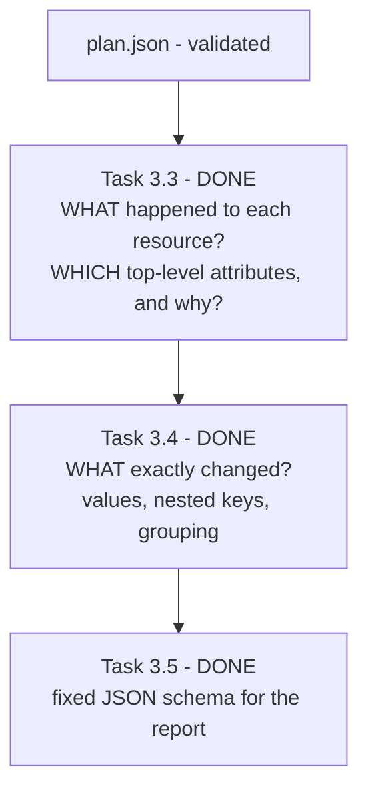

> **Recommendation:** before starting Task 3.4, re-read its objective with this table in
> mind, so the work is "add values, nested diffs and grouping" and not "redo
> identification". It is also worth confirming how Task 3.4 relates to Phase 4 Task 4.4
> ("deep attribute diffs"); see [Section 18](#18-known-ambiguities--open-questions).

---

## 9. Drift Classification Matrix

These are the **actual rules** from spec §6 as implemented in `scripts/detect_drift.py`.

**Letters:** **S** = State, **R** = Real (Azure, refreshed), **D** = Desired (configuration).

### Attribute level (one property, e.g. `tags`)

| Actual vs State (R vs S) | Configuration vs State (D vs S) | Configuration vs Actual (D vs R) | Attribute class | Plain meaning |
|---|---|---|---|---|
| same | same | same | *(not listed)* | Nothing changed |
| **different** | same | different | `drifted` | Azure changed; my code didn't; Terraform would undo it |
| **different** | different | **same** | `drifted_converged` | Azure changed, and my code already matches the new value |
| same | **different** | different | `config_changed` | My code changed; Azure didn't |
| **different** | **different** | **different** | `drifted_and_config_changed` | Both changed, differently. **Ambiguous** |
| — | value unknown until apply | — | `unknown_until_apply` | Can't classify from the plan (e.g. a new `id`) |

### Resource level (the whole resource)

| `resource_drift` (S vs R) | `resource_changes` action (R vs D) | Resource class | Plain meaning |
|---|---|---|---|
| none | `no-op` | `in_sync` | Everything matches |
| `update` | update/replace, with a `drifted` attribute | `external_drift` | Azure changed; Terraform would revert it |
| `delete` (object gone) | `create` | `external_deletion` | Deleted outside Terraform; Terraform would recreate it |
| present | `no-op` (or no entry) | `converged_drift` | Drift happened, but Azure already matches my code. **Exit code 0!** |
| none | `update` / `replace` (or move/import) | `config_change` | My code changed; no external change seen |
| none | `create` | `resource_added` | My code declares a new resource |
| none | `delete` | `resource_removed` | My code no longer declares a resource |
| present | non-no-op, with drift **and** config attributes (or `delete` of a drifted object) | `drift_and_config_change` | Both sides changed (ambiguous if the *same* attribute) |
| present | non-no-op that no attribute explains | `undetermined` | Evidence not enough. **Always ambiguous**, never guessed |

**Plan-level flags:**

| Field | Meaning |
|---|---|
| `has_drift: true` | At least one managed resource is in `resource_drift` |
| `has_drift: false` | Evidence valid **and** no drift entries |
| `has_drift: null` | Evidence failed or was rejected → **unknown** |
| `summary.output_only_change: true` | Only Terraform outputs changed. Not drift (exit code 2 anyway) |

### Verified with real Terraform evidence

| Scenario fixture | Plan exit code | Result |
|---|---|---|
| `in_sync` | 0 | `in_sync`, `has_drift: false` |
| `config_change` | 2 | `config_change` (`tags` = `config_changed`), `has_drift: false` |
| `external_drift` | 2 | `external_drift` (`tags` = `drifted`), `has_drift: true` |
| `drift_and_config_change` | 2 | `drift_and_config_change`, ambiguous |
| `converged_drift` | **0** | `converged_drift`, `has_drift: true` |
| `resource_added` | 2 | `resource_added` |
| `resource_removed` | 2 | `resource_removed` (+ `resource_added` for the replacement key) |
| `external_deletion` | 2 | `external_deletion`, `has_drift: true` |
| `replace` | 2 | `config_change` with action `replace` |
| `output_only_change` | 2 | all `in_sync`, `output_only_change: true`, `has_drift: false` |
| `failed_run` | 1 | `outcome: failed`, `has_drift: null` |

---

## 10. Resource-Level vs Attribute-Level

```text
RESOURCE LEVEL
"What happened to the whole resource?"
        ↓
ATTRIBUTE LEVEL
"Which property is involved, and on which side did it change?"
        ↓
VALUE LEVEL  (Task 3.4 - built)
"What exactly was the old and new value?"
```

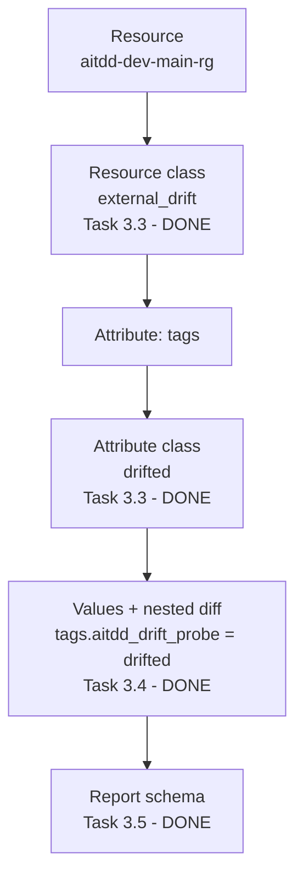

### Example 1 — external drift

```text
Resource:                 aitdd-dev-main-rg
Resource classification:  external_drift
Attribute:                tags
Attribute classification: drifted
Values (Task 3.4):        tags.aitdd_drift_probe: state absent, real "task-3.6", desired absent
```

### Example 2 — replacement caused by my code

I change `location` in `dev.tfvars`. A Resource Group can't move, so Terraform must
**replace** it:

```text
Resource:                 aitdd-dev-main-rg
Resource classification:  config_change   (action: replace)
Attributes:               location = config_changed
                          id       = unknown_until_apply   (new object, new id)
                          managed_by = config_changed      (see note below)
```

> **Known quirk:** for a replacement, D describes a *brand-new* object. Optional attributes
> I never set (like `managed_by`) show up as `config_changed` (`""` → `null`). The
> classifier keeps this, because it is what the evidence says, and adds a note. It does not
> hide it. Since Task 4.4 the comparator assesses such paths (`configured` / `noise` /
> `unconfigured` / `undetermined`); nothing is dropped (spec §9).

### Who owns what

| Level | Owner | Status |
|---|---|---|
| Resource class | Task 3.3 | 🟢 |
| Attribute names + classes (top-level) | Task 3.3 (spec §6.2) | 🟢 |
| Identification fields (address, type, name, …) | Task 3.3 (overlaps 3.4's objective) | 🟢 |
| Attribute values, nested diffs, grouping by type | Task 3.4 | 🟢 |
| Fixed report format (`drift_report.schema.json`) | Task 3.5 | 🟢 |
| Typed Python models (`DriftItem`, `AttributeChange`, …) | Phase 4 | 🟢 |
| Severity (`CRITICAL` … `INFO`) | Phase 4, Task 4.5 (in the report since Task 6.2A) | 🟢 |
| Who/what made the change | Phase 7 (opt-in; only where Activity Log evidence establishes it) | 🟢 |

---

## 11. Terraform Evidence

### Why raw Terraform output isn't enough

`terraform plan` prints text meant for humans. Its wording and formatting can change and it
hides details. The exit code is also **not enough**: Section 2 showed that exit codes 0
and 2 can each mean several different things.

### Why machine-readable evidence is needed

`terraform show -json` gives the full, structured plan: `resource_drift`,
`resource_changes`, `output_changes`, `errored`, `complete` and more. A program can
read this reliably, and the same JSON always gives the same answer.

### Evidence flow

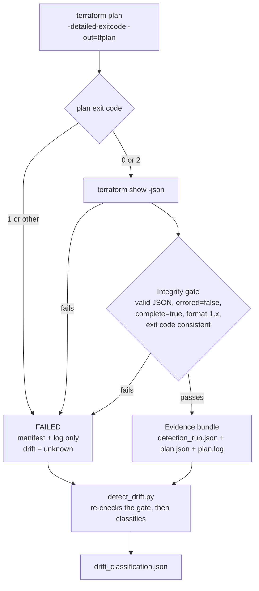

### What the evidence bundle contains

| File | Purpose |
|---|---|
| `detection_run.json` | The "receipt": succeeded/failed, failure stage and reason, plan/show exit codes, Terraform version, environment, backend key, git commit, timestamps, run id |
| `plan.json` | The machine-readable plan (only for successful plans) |
| `plan.log` | Human-readable Terraform output for debugging |
| `drift_classification.json` | Written by `detect_drift.py` (or `drift-engine analyze --output`) next to the bundle; the plan calls it `drift_report.json` |

The bundle is always written **outside the repository** (a temp folder locally, or
`$RUNNER_TEMP` in CI) so it can never be committed by accident.

### Why evidence is sanitized

Real plans contain real identifiers, for example the **Azure subscription ID** inside
resource IDs like `/subscriptions/<id>/resourceGroups/...`. The repository is **public**,
so the committed test fixtures had:

- the subscription ID replaced with `<AZURE_SUBSCRIPTION_ID>`
- local machine paths replaced with `terraform/environments/dev`

The fixtures keep the full Terraform structure, so they are still realistic test data.

### Why `plan.json` is ignored

`.gitignore` ignores every `plan.json`, `tfplan` and `*.tfstate`. Real plans can contain
sensitive values **in clear text** and real resource IDs. This rule is a deliberate safety
net and was **not** weakened.

### Why `plan.sanitized.json` exists

Because of that ignore rule, a fixture named `plan.json` would silently never be
committed, and tests would fail on a fresh clone. So fixtures are stored as
**`plan.sanitized.json`**. The test suite copies them into a temporary folder as proper
`plan.json` bundles before running. Result: real-looking tests, and `.gitignore` stays
strict.

### Why the classifier must be deterministic

- **Trust:** the same evidence must always produce the same answer, or no one can rely on it.
- **Testability:** tests can assert exact results (the suite even checks byte-identical output).
- **AI boundary:** later, AI *explains* this fixed result. If the result could change between
  runs, AI explanations would be built on sand.
- **Works without AI:** detection must work even if the LLM is unavailable (Core Principle).

---

## 12. Testing Strategy

```text
Unit Tests (pytest; latest recorded full run: 1137 passed, 679 skipped without the ai/azure extras)
    +
Real Terraform Evidence Fixtures (11 scenarios)
    +
Synthetic Edge Cases + synthetic plans for the AI engine
    +
Safeguard mutation checks
    +
Fresh Clone Validation
    +
Terraform Validation (validate.sh) + TFLint + Trivy config
    +
Real end-to-end runs (Azure tag drift, workflow runs, CI proofs)
```

| Layer | What it is | What it protects against |
|---|---|---|
| **Unit tests** | `tests/test_*.py`, run with `pytest`. Started with 43 classifier tests at commit `3e2a696`; at Task 9.2 the full run was 1137 passed, 679 skipped (optional `ai`/`azure` extras absent), with 96.05% `drift_engine` coverage (gate 85%) | Logic bugs in classification, validation, the AI engine, attribution, issues and scanners |
| **Real evidence fixtures** | 11 bundles in `tests/fixtures/plan_evidence/`, produced by real Terraform 1.14.7 (sanitized) | Testing against an imagined plan format instead of the real one |
| **Synthetic edge cases** | Hand-made inputs: malformed JSON, errored plans, exit-code mismatches, move/import, `undetermined`; synthetic plans for the AI engine | Rare paths that are hard or unsafe to create for real |
| **Invalid-evidence tests** | Cases where the evidence is wrong | A broken run ever being reported as "no drift" |
| **Mutation checks** | Deliberately broken copies of safeguards (Task 6.7 harness, Phase 8 mutants, Phase 9 scanner mutation matrices on scratch copies) | Tests that pass even when a safeguard is removed |
| **Fresh-clone validation** | Running tests on a copy containing only files git would commit | Tests that pass only because of an ignored local file |
| **Terraform checks** | `./scripts/validate.sh` (fmt + validate, offline), `./scripts/run_tflint.sh`, `./scripts/run_trivy_config.sh` | Broken, lint-failing or insecure Terraform code |
| **Real end-to-end** | Approved real Azure tag drift (Tasks 3.6–3.7); real workflow runs (Phases 5, 8); CI proofs with a green push and a deliberately failing PR (Tasks 9.1, 9.2) | Pieces that work alone but not together |

How to run:

```bash
pytest --cov=src/drift_engine tests/
```

```bash
./scripts/validate.sh
```

> **Gap to know about:** the Task 3.2 script was tested with a temporary "stub terraform"
> suite (16 cases) that lived in a scratch folder and **is not in the repository**. A
> committed test suite for `generate_plan_json.sh` would be a useful future addition
> (Phase 12 covers testing broadly).

---

## 13. Security Design

### Implemented today 🟢

| Control | How |
|---|---|
| **No passwords in CI** | GitHub Actions uses OIDC; the app registration has zero secrets and zero certificates |
| **Narrow OIDC trust** | Federated credential only for this repo's `main` branch (GitHub's immutable subject format) |
| **Least-privilege RBAC** | Exactly 2 roles: `Reader` (subscription) and `Storage Blob Data Contributor` (`tfstate` container only) |
| **CI cannot apply** | No write permissions on resources; storage key listing denied; state access via Entra ID (`ARM_USE_AZUREAD=true`) |
| **State protection** | Private container, HTTPS + TLS 1.2, blob versioning, 7-day soft delete |
| **No secrets in Git** | `.gitignore` excludes state, plans, `plan.json`, `.env`, `*.tfvars` (except the secret-free `dev.tfvars`) |
| **No IDs in docs/fixtures** | Subscription/tenant/client IDs replaced with placeholders; fixtures sanitized |
| **Evidence outside the repo** | `generate_plan_json.sh` refuses an output folder inside the repository |
| **No forbidden flags** | Script refuses `TF_CLI_ARGS*` (which could sneak in `-refresh=false`, `-target`, `-lock=false`) |
| **No apply in detection** | Neither script can run `terraform apply` |
| **Classifier isolation** | `detect_drift.py` uses only the Python standard library: no Terraform, Azure, network or LLM calls |
| **Sensitive values** | Values Terraform marks sensitive are redacted, including inside lists and nested blocks (Tasks 3.4, 6.2A) |
| **Deterministic detection** | Fixed rules, byte-identical output, failures = unknown, never "no drift" |
| **Consequential actions need approval** | Execution Rules 10 and 13: `apply`, Azure changes, credential changes need my explicit OK |
| **Public report artifact only** | The workflow uploads only the redacted report + manifest; raw plan evidence stays on the runner (Task 5.4) |
| **Public issue profile** | Drift issues show structure only: no values, HCL, AI output, Activity Log data or caller identity; GUIDs/ARM IDs masked (Task 8.1) |
| **AI cannot decide or invent** | AI never changes drift or severity; evidence-vs-inference checks reject invented attributes or blame (Task 6.7); LLM opt-in only |
| **State destroy protection** | `prevent_destroy` on the state storage account and container (Task 9.1) |
| **Static security scanning** | TFLint + Trivy config on every push/PR, no Azure access; Trivy is a SHA-256-verified pinned binary with embedded checks; HIGH/CRITICAL block (Tasks 9.1, 9.2) |
| **Accepted risk, enforced** | AZU-0012 (no network rules on the state account) is accepted only by an exact, expiring (2027-03-31) record checked by a script; no `.trivyignore` or Trivy suppression |

### Planned ⬜ (not implemented yet)

| Control | Phase |
|---|---|
| TruffleHog secret scanning (after its design review) | 9.3 |
| Super-Linter code quality checks (after its design review) | 9.4 |
| Human approval gates before any remediation apply | 11 |
| Full RBAC/secret hardening audit | 12.3 |
| Pinning GitHub Actions by commit SHA | 12 |

---

## 14. Git / Development Workflow

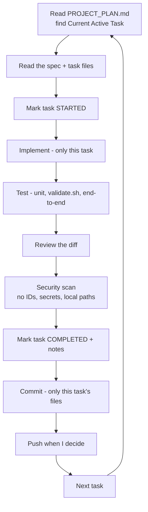

**Rules the project follows** (from `PROJECT_PLAN.md` Execution Rules):

- **One task at a time.** Never start the next task automatically.
- **Resume from the plan.** `PROJECT_PLAN.md` says where we are; don't rediscover progress.
- **No scope expansion** without approval.
- **Stop on incorrect plans.** If a task is wrong or unsafe, stop and explain.
- **Consequential operations need approval:** `terraform apply`, Azure changes, credentials,
  GitHub settings.

### Why commit completed work before moving on

- **Safe checkpoint:** if Task 3.4 goes wrong, I can return to the known-good Task 3.3.
- **Clean history:** each commit tells one story ("classifier implemented").
- **Reviewable:** small, focused diffs are easier to check for secrets and mistakes.
- **Public repo:** reviewing before each commit is when leaks get caught (this already
  happened once, when identifiers were redacted from `PROJECT_PLAN.md` before a push).

### History so far

| Commit | What |
|---|---|
| `172765e` | Initial commit: Phase 1–2 Terraform foundation and remote state |
| `da7ecba` | Fix CI workflow for OIDC auth test (Task 2.6) |
| `d6f5ba4` | docs: finalize Phase 2 architecture and OIDC documentation |
| `3e2a696c06a74bfbbf269b2f263a732c268a6a1c` | feat: implement terraform drift detection classifier (Tasks 3.1–3.3) |

*(Historical context only: the first commits. Every later task records its commits in its
`PROJECT_PLAN.md` completion notes; `git log` has the full history. Recent milestones:
`b34803f` TFLint gate (9.1), `49eea22` Trivy config scan (9.2), `fae5782` Task 9.2 complete.)*

---

## 15. Current Project Status — One Screen Summary

| Area | Status | What's done | What's next |
|---|---|---|---|
| **Phase 1** | 🟢 | Resource Group `aitdd-dev-main-rg` (Central India), module, `validate.sh`, docs | — |
| **Phase 2** | 🟢 | Remote state, bootstrap, OIDC, 2-role plan-only RBAC, green CI run, docs | — |
| **Phase 3** | 🟢 | Spec, evidence generation, classifier, values/nested diffs, report schema, real Azure drift test (18/18) | — |
| **Phase 4** | 🟢 | `src/drift_engine`, severity, `drift-engine analyze` | — |
| **Phase 5** | 🟢 | `drift-detection.yml` (daily + manual), report artifact, `drift_detected` | — |
| **Phase 5A** | 🟢 | VNet, subnet, NSG, association | — |
| **Phase 6** | 🟢 | AI analysis engine (library, LLM opt-in) | CLI + no-LLM CI (Phase 9A) |
| **Phase 7** | 🟢 | Activity Log collector + attribution (opt-in) | — |
| **Phase 8** | 🟢 | Drift issues create/update/close (8.1, 8.3) | Remediation PRs moved to Phase 11 |
| **Phase 9** | 🟡 | TFLint (9.1) and Trivy config (9.2), validated in CI | **Task 9.3 TruffleHog (design review)**, then 9.4 |
| Phases 9A–14 | ⬜ | Task lists drafted in `PROJECT_PLAN.md` | Each after its design review |
| Real external drift tested in Azure? | ✅ Yes | Tag drift on `aitdd-dev-main-rg`, detected and reverted (Tasks 3.6–3.7) | — |
| Detection running in CI? | ✅ Yes | Daily scheduled + manual runs | — |

**Current phase:** Phase 9 — DevSecOps Integration
**Current active task:** Task 9.3 — TruffleHog Secret Scanning (dedicated design review required before implementation)

---

## 16. If I Understand Only 10 Things, They Should Be These

1. **Configuration is what I want, state is what Terraform remembers, Azure is what
   really exists.** Drift detection is about comparing these three.
2. **Drift means Azure differs from Terraform's state.** Terraform reports it in
   `resource_drift`. A plan change is *not* automatically drift.
3. **The exit code does not decide drift.** Exit 2 can be my own code change; exit 0 can
   hide converged drift. Only the JSON evidence decides.
4. **A failed run is "unknown", never "no drift".** That is why there is an integrity gate
   and `has_drift: null`.
5. **Terraform evidence (`plan.json` + manifest) is the input to everything.** It is
   machine-readable, validated twice, and kept outside the repository.
6. **The classifier is deterministic:** same input, same output, fixed rules, no AI, no
   network.
7. **AI explains drift. It never decides whether drift exists**, and it must not invent
   who caused it. That is Phase 7's job, using Activity Log evidence, and only where that
   evidence establishes it.
8. **Resource level and attribute level are different questions:** "what happened to the
   resource?" (e.g. `external_drift`) vs "which property, and on which side?" (e.g. `tags` =
   `drifted`). Values and nested diffs (Task 3.4) answer "what exactly changed".
9. **Phase 1 was intentionally one Resource Group.** Small scope made every result easy to
   verify. The network was added in Phase 5A; storage and Key Vault stay deferred.
10. **CI is plan-only by design.** GitHub can read Azure and the state, but cannot change
    resources. Any real fix will need human approval (Phase 11).

---

## 17. Glossary

| Term | Simple explanation | In this project |
|---|---|---|
| **Terraform** | A tool that creates and manages infrastructure from code | Manages `aitdd-dev-main-rg` and the state storage |
| **Terraform Configuration** | The `.tf` / `.tfvars` files describing what I want | `terraform/environments/dev/` + `dev.tfvars` (the **D** view) |
| **Terraform State** | Terraform's memory of what it created | Blob `dev.tfstate` in container `tfstate` (the **S** view) |
| **Actual** | What really exists in the cloud right now | Azure as seen during refresh (the **R** view) |
| **Terraform Plan** | Terraform's preview of what it would change | Run with `-detailed-exitcode -out=tfplan`, never applied in detection |
| **Refresh** | Terraform asking Azure for the current real values | Must stay ON; `-refresh=false` is forbidden because it hides drift |
| **Drift** | Real infrastructure differs from Terraform's state | Any managed resource in `resource_drift` → `has_drift: true` |
| **Configuration Change** | My code wants something different from the state | Classes `config_change`, `resource_added`, `resource_removed`. Not drift |
| **Converged Drift** | Drift happened, but Azure already matches my code | `converged_drift`; plan exit code is 0 even though drift exists |
| **Evidence** | Machine-readable proof of what Terraform saw | Bundle: `detection_run.json`, `plan.json`, `plan.log` |
| **Resource** | One managed cloud object | e.g. `module.resource_group.azurerm_resource_group.this["main"]` |
| **Attribute** | One property of a resource | e.g. `tags`, `location`, `name` |
| **Classifier** | Code that sorts findings into fixed categories | `scripts/detect_drift.py` |
| **Deterministic** | Same input always gives exactly the same output | Rules only, no AI, no randomness, byte-identical output |
| **Fixture** | Saved sample input for tests | 11 sanitized real evidence bundles in `tests/fixtures/plan_evidence/` |
| **Remote Backend** | Storing Terraform state somewhere shared instead of locally | AzureRM backend → `aitddtfstatesa001` / `tfstate` |
| **AzureRM** | Terraform's Azure provider (also the backend type name) | `hashicorp/azurerm` `~> 5.0` (v5.7.0 locked) |
| **Terraform Provider** | Plugin that lets Terraform talk to a platform | `azurerm` talks to Azure |
| **OIDC** | Login using short-lived tokens instead of stored passwords | GitHub Actions → Entra ID, no client secret |
| **Entra ID** | Microsoft's identity service (formerly Azure AD) | Hosts app registration `aitdd-github-oidc` |
| **RBAC** | Role-Based Access Control: who can do what | `Reader` + `Storage Blob Data Contributor` (container scope) |
| **Integrity gate** | A checklist evidence must pass before it is trusted | Valid JSON, `errored=false`, `complete=true`, format 1.x, consistent exit code |
| **Manifest** | Small file describing a run | `detection_run.json` |
| **Exit code** | Number a program returns when it finishes | Plan: 0 = no pending changes, 2 = pending changes, 1 = error |
| **Bootstrap** | Setup that creates what the main setup needs first | `terraform/bootstrap` creates the state storage (keeps local state) |
| **Sanitize** | Remove sensitive/identifying data | Subscription ID → `<AZURE_SUBSCRIPTION_ID>` in fixtures |
| **Severity** | Deterministic rating of a change's impact | `CRITICAL` … `INFO` from `drift_engine.severity`; authoritative, AI never changes it |
| **TFLint** | Static linter for Terraform code | `scripts/run_tflint.sh`, pinned 0.64.0 + AzureRM ruleset 0.32.0 (Task 9.1) |
| **Trivy config** | Static security scanner for Terraform | `scripts/run_trivy_config.sh`, pinned 0.75.0; HIGH/CRITICAL block (Task 9.2) |
| **Risk acceptance** | A documented, time-limited decision to accept one known finding | `security/trivy-risk-acceptance.json`: AZU-0012 on the state account until 2027-03-31, enforced by script |

---

## 18. Known Ambiguities & Open Questions

I found these while reading the repository at commit `3e2a696`. The **Status (2026-10-03)**
column records what happened since; `PROJECT_PLAN.md` has the details.

| # | Topic | What I found | Suggested handling | Status (2026-10-03) |
|---|---|---|---|---|
| 1 | **Task 3.3 / 3.4 overlap** | Task 3.3 already outputs identification fields and top-level attribute classes, part of Task 3.4's objective wording. | Treat Task 3.4 as "values + nested diffs + grouping + redaction" ([Section 8](#8-task-33-vs-task-34--where-the-boundary-is)). | ✅ Resolved: Task 3.4 done that way |
| 2 | **Phase 3 vs Phase 4 overlap** | Phase 4 plans a new package `src/drift_engine/` overlapping `scripts/detect_drift.py` and Task 3.4. | Migrate `detect_drift.py` into `src/drift_engine/` rather than rebuilding it. | ✅ Resolved: code moved, not rewritten (Phase 4) |
| 3 | **README is out of date** | README listed `network`, `storage` and `key-vault` modules that do not exist, and old phase statuses. | Fix during a documentation task. | ✅ Resolved: README updated to the current plan |
| 4 | **`architecture.md` is out of date** | Header said "Phase 2 in progress"; it listed modules and storage that do not exist. | Same as #3. | ✅ Resolved: updated to the current plan |
| 5 | **Pull-request workflow runs** | `terraform-auth-test.yml` triggers on `pull_request`, but the OIDC federated credential exists only for `main`. PR runs fail at Azure login. | Add a PR credential or drop the PR trigger. | ⏳ Still open: PR runs fail with `AADSTS700213` (seen in the Task 9.1/9.2 CI proofs); relevant to Task 12.3 |
| 6 | **AI root cause before Activity Log** | Task 6.5 comes before Phase 7. AI must not claim who made a change without Phase 7 evidence. | Keep Task 6.5 strictly to evidence-based, labelled hypotheses. | ✅ Handled: attribution stays unknown/unconfirmed in the AI report |
| 7 | **Test framework wording** | Phase 12 says `pytest`; tests used `unittest`. | Decide in Phase 4.1. | ✅ Resolved: `pytest` (dev extra) runs the whole suite |
| 8 | **Task 3.2 tests not committed** | The 16-case stub suite for `generate_plan_json.sh` lived in a scratch folder only. | Consider committing a script test suite later. | ⏳ Still open (Phase 12) |
| 9 | **Unverified Terraform behaviours** | Exit codes for move-only/import-only plans are unverified. | Verify when moves/imports are introduced. | ⏳ Still open (spec §5.3, §9) |
| 10 | **Real drift not yet proven** | External drift was only proven by simulation. | Tasks 3.6–3.7, with approval. | ✅ Resolved: real tag drift detected and reverted (2026-10-02) |
| 11 | **Unpushed commit** | Commit `3e2a696` existed only locally. | Push when ready. | ✅ Resolved: pushed |

---

*End of guide. This file is documentation for me only. It does not change any task status.
For official statuses, always check `PROJECT_PLAN.md`.*
