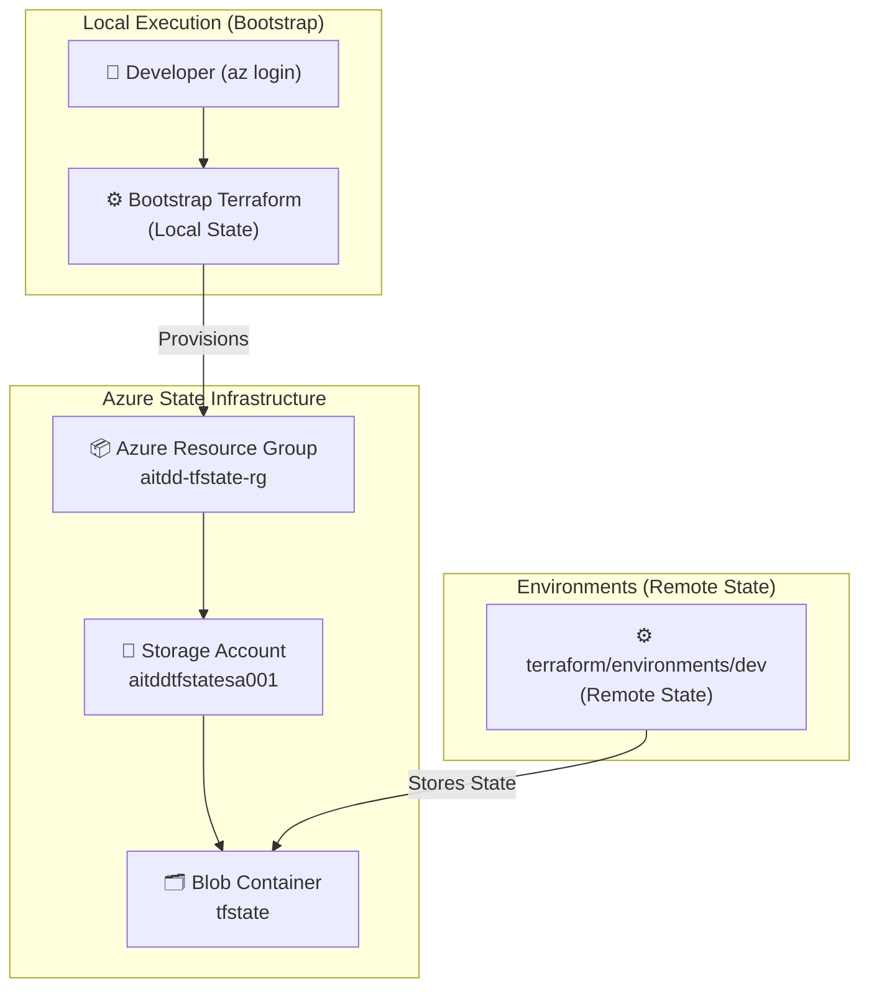
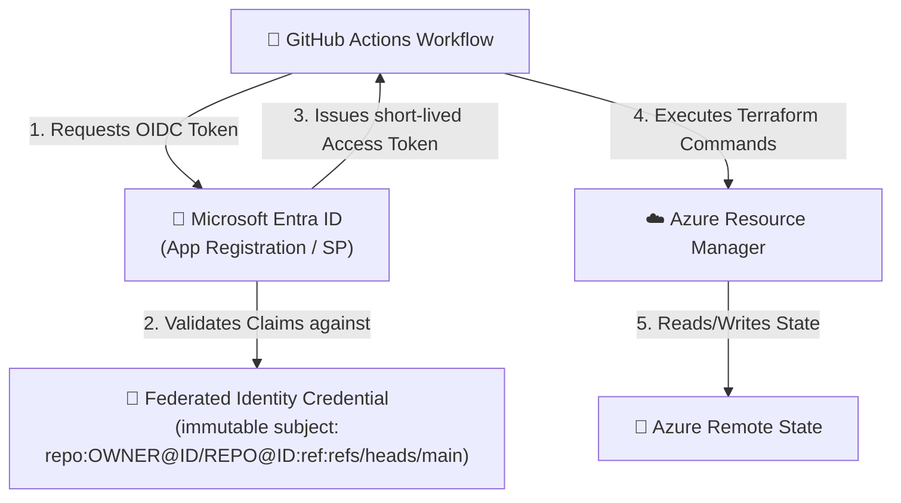
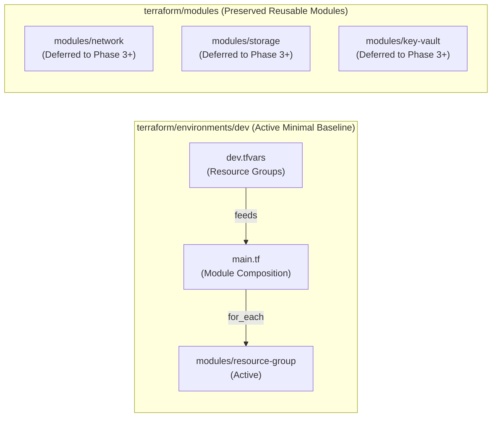

# Architecture — AI-Powered Terraform Drift Detection & Remediation Platform

## 1. Project Purpose

This platform detects, analyzes, and remediates **infrastructure drift** — the gap between what Terraform expects and what actually exists in Azure. The final product will combine Terraform, Python, LangGraph/LLM analysis, GitHub automation, and a professional dashboard.

**Current Status: Phase 1 completed (Minimal Foundation in Central India). Phase 2 in progress (infrastructure deployment pending).**

---

## 2. Phases Scope & Status

| Phase | Description | Scope | Status |
|---|---|---|---|
| **1** | **Azure + Terraform Infrastructure** | Minimal Resource Group baseline in `Central India`; reusable modules preserved for Network, Storage, Key Vault | ✅ Complete |
| **2** | **Remote State & Secure Auth** | Dedicated Storage Backend (`Central India`), Bootstrap module, Remote State, GitHub OIDC (plan-only CI) | ✅ Complete |
| 3 | Drift Detection Engine | Scheduled plan analysis, state vs actual state comparison | ⬜ Planned |
| 4 | Python Drift Parser | Structured JSON extraction from plan files | ⬜ Planned |
| 5 | GitHub Actions Automation | CI/CD scheduled workflow for drift runs | ⬜ Planned |
| 6 | LangGraph AI Analysis | Root cause analysis using LLM agents | ⬜ Planned |
| 7 | Azure Activity Log | Identify who/what mutated Azure resources out-of-band | ⬜ Planned |
| 8 | GitHub Issue / PR Remediation | Human-in-the-loop approval workflows | ⬜ Planned |

---

## 3. Remote Terraform State Architecture (Phase 2)

### The Backend Bootstrap Problem

Terraform remote state backends create a chicken-and-egg problem:
* Remote backend configuration requires an Azure Storage Account and Blob Container to already exist.
* If Terraform manages its own backend storage in the same state, initializing state requires resources that haven't been created yet.

### The Bootstrap Solution

To avoid circular dependencies, the project uses a **dedicated bootstrap module** located at [`terraform/bootstrap`](../terraform/bootstrap):



### Remote State Security Controls

| Security Control | Implementation |
|---|---|
| Dedicated Isolation | State storage is entirely isolated from application storage (`aitddtfstatesa001` vs `aitdddevsa001`). |
| Encryption | Encrypted at rest using Azure-managed keys with TLS 1.2 minimum in transit. |
| Access Control | Container access is private (`container_access_type = "private"`). No public blob access. |
| State Versioning | Storage Blob Versioning enabled for recovery from state corruptions. |
| Soft Delete | Container and Blob 7-day soft-delete retention policies active. |
| No Committed Secrets | Local state, plan artifacts, and credentials are in `.gitignore` (`*.tfstate`, `*.tfstate.*`, `.terraform/`, `tfplan`, `*.tfplan`, `plan.json`). Only `.terraform.lock.hcl` and the secret-free `dev.tfvars` are committed. |
| Dev State Blob | The `dev` environment's state is the blob `dev.tfstate` inside the `tfstate` container. |
| Bootstrap State | `terraform/bootstrap` intentionally keeps **local** state (it provisions the backend it would otherwise store state in). That state is never committed, so CI validates bootstrap offline only (`init -backend=false` + `validate`) and never plans it. |

---

## 4. Azure & CI/CD Authentication (Phase 2)

### Local Development Authentication

Local developers authenticate using the Azure CLI:
```bash
az login
az account set --subscription "<subscription-id>"
```
Terraform automatically inherits these credentials without needing hardcoded secrets or service principal keys.

### GitHub Actions OIDC Authentication

For CI/CD automation, the project relies on **GitHub Workload Identity / OpenID Connect (OIDC)** federated credentials instead of long-lived service principal client secrets.



### Azure RBAC Permissions (GitHub OIDC Identity)

The GitHub Actions identity is the Entra ID App Registration / service principal
**`aitdd-github-oidc`**. The following are its **actual, verified** assignments — exactly
two, and nothing else:

| Identity Role | Scope | Purpose |
|---|---|---|
| **Reader** | Subscription | Read-only resource metadata so `terraform plan` can refresh state against live Azure. Grants `*/read` only. |
| **Storage Blob Data Contributor** | `tfstate` **container** (`aitddtfstatesa001`) | Read, write, and lock the Terraform state blobs in that one container. |

Deliberately **not** assigned to this identity:

| Not Assigned | Why |
|---|---|
| `Storage Blob Data Contributor` at subscription or storage-account scope | Container scope is narrower; a broader grant would expose every blob container in the subscription. |
| `Contributor` on any scope | CI is **plan-only**. Write access is not required and is withheld by design. |
| `Owner`, `User Access Administrator` | Never required by this workload. |
| `Key Vault Secrets Officer` | No Key Vault is deployed; the module is preserved but unused. |

The identity has **no group or directory-role memberships**, so there are no inherited
permission paths, and it requests **no** Microsoft Graph or API permissions.

### CI Security Model — Plan-Only

GitHub Actions is currently **plan-only** and has **no autonomous `terraform apply`
capability**. This is enforced by RBAC, not merely by workflow convention: the identity
holds no write actions. Verified against the Azure role definitions —
`resourceGroups/write`, `resourceGroups/delete`, `storageAccounts/write`,
`storageAccounts/listkeys/action`, and `deployments/write` are all **denied**.

Because `listkeys` is denied, Terraform cannot retrieve a storage account access key.
State access therefore goes through Microsoft Entra ID on the storage data plane
(`ARM_USE_AZUREAD=true`), with no account key and no client secret anywhere in the
pipeline.

> **Future / conditional only — not current access.** Should a later phase introduce
> automated remediation, any write capability (for example a narrowly scoped
> `Contributor` on `aitdd-dev-main-rg`) would be a **future** change requiring explicit
> human approval, and is **not** granted today. The project principle *No autonomous
> apply* stands: remediation requires human approval.

---

## 5. Modular Infrastructure Architecture (Phase 1)



### Data-Driven Design & Incremental Expansion

1. **Active Minimal Foundation**: Phase 1 activates only the Azure Resource Group (`aitdd-dev-main-rg`) in `Central India`. This provides the cleanest, smallest practical infrastructure baseline for establishing remote state and testing deterministic drift detection.
2. **Preserved Reusable Modules**: Modules for Virtual Networks, Subnets, NSGs, Storage Accounts, and Key Vaults are implemented and preserved under `terraform/modules/`. They will be plugged into `dev/main.tf` in subsequent phases to produce rich multi-resource drift scenarios.
3. **Data-Driven Scalability**: When activating additional resources, configurations are added to the corresponding map in `dev.tfvars` without redesigning core architectures.

---

## 6. Resource Naming Convention

```
<project_name>-<environment>-<resource_name>-<resource_type_suffix>
```

| Example | Breakdown |
|---|---|
| `aitdd-tfstate-rg` | Resource group containing Terraform state storage |
| `aitddtfstatesa001` | Dedicated storage account for state (3-24 lowercase alphanumeric) |
| `aitdd-dev-main-rg` | Application dev resource group |
| `aitdd-dev-main-vnet` | Main dev virtual network (10.10.0.0/16) |
| `aitdd-dev-app-snet` | Application subnet (10.10.1.0/24) |
| `aitdd-dev-app-nsg` | Application Network Security Group |
| `aitdddevsa001` | Application dev storage account |
| `aitdd-dev-kv-001` | Application dev Key Vault |
