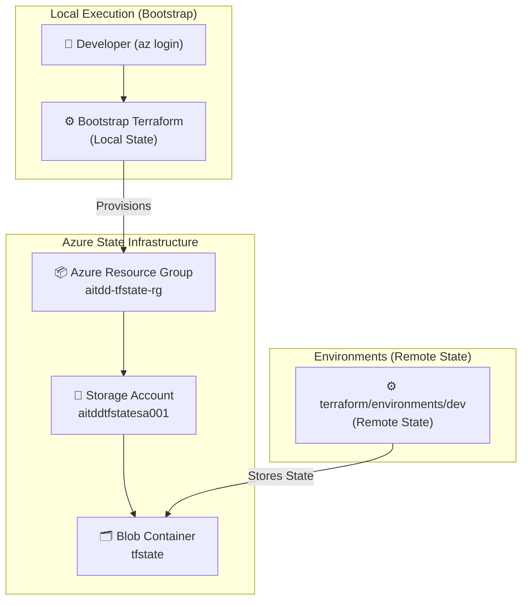
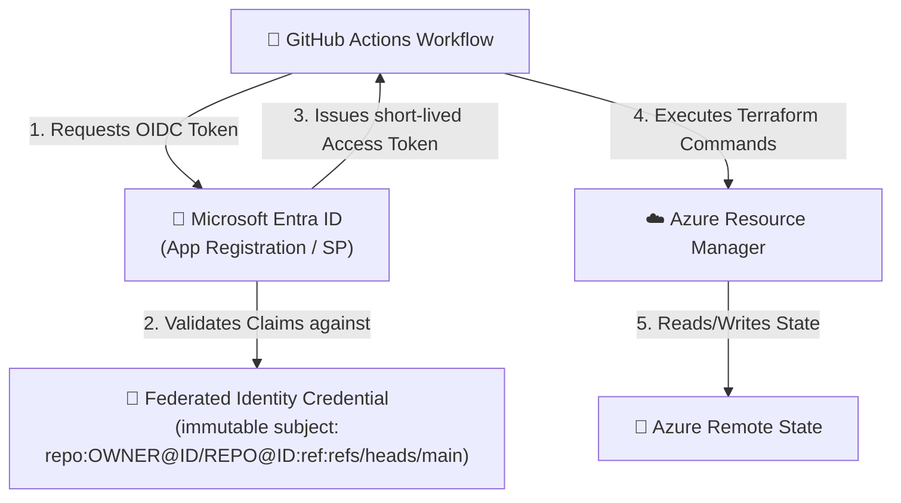
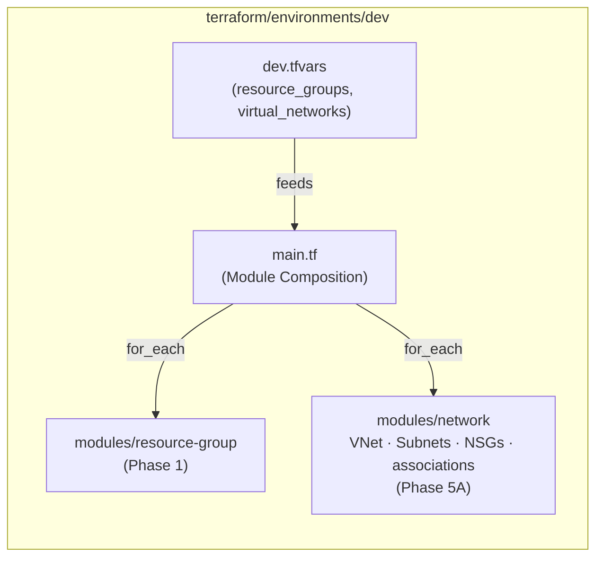

# Architecture — AI-Powered Terraform Drift Detection & Remediation Platform

## 1. Project Purpose

This platform detects, analyzes, and remediates **infrastructure drift** — the gap between what Terraform expects and what actually exists in Azure. The final product will combine Terraform, Python, LangGraph/LLM analysis, GitHub automation, and a professional dashboard.

**Current Status (2026-10-03):** Phases 1–8 are complete, and so is the lettered expansion Phase 5A (placed after Phase 5 and before Phase 6). `PROJECT_PLAN.md`'s "Phases Completed: 8 of 14" counts only the numbered phases. Phase 9A (AI analysis integration, before Phase 10) is planned and not started. Phase 9 (DevSecOps) is in progress: Task 9.1 TFLint and Task 9.2 Trivy config are complete; Task 9.3 TruffleHog (design review) is next. [`PROJECT_PLAN.md`](../PROJECT_PLAN.md) is the single source of truth for status; this document covers the infrastructure, security and CI-access design.

---

## 2. Phases Scope & Status

| Phase | Description | Scope | Status |
|---|---|---|---|
| **1** | **Azure + Terraform Infrastructure** | Minimal Resource Group baseline in `Central India` | ✅ Complete |
| **2** | **Remote State & Secure Auth** | Dedicated Storage Backend (`Central India`), Bootstrap module, Remote State, GitHub OIDC (plan-only CI) | ✅ Complete |
| **3** | **Deterministic Drift Detection** | Plan evidence, integrity gate, classification, report schema, real Azure drift validation | ✅ Complete |
| **4** | **Python Drift Engine** | `src/drift_engine`: parser, models, comparator, severity, `drift-engine analyze` | ✅ Complete |
| **5** | **Automated Drift Detection Workflow** | `drift-detection.yml`: daily + manual, OIDC, report artifact, `drift_detected` output | ✅ Complete |
| **5A** | **Dev Infrastructure Expansion** | VNet, Subnet, NSG and Subnet–NSG association in `dev` | ✅ Complete |
| **6** | **LangGraph AI Analysis** | `src/ai_engine` library; LLM opt-in; no CLI/CI integration yet (Phase 9A) | ✅ Complete |
| **7** | **Azure Activity Log Investigation** | Activity Log collector and deterministic attribution (opt-in, not in any workflow) | ✅ Complete |
| **8** | **GitHub Issue / PR Automation** | Drift issues create/update/close (8.1, 8.3); remediation PRs (8.2) superseded by Phase 11 | ✅ Complete |
| 9 | DevSecOps Integration | `security-scan.yml`: TFLint (9.1 ✅), Trivy config (9.2 ✅); TruffleHog (9.3), Super-Linter (9.4) pending | 🟡 In progress |
| 9A–14 | AI CI integration, FinOps, human-approved remediation, hardening, dashboard, final docs | See `PROJECT_PLAN.md` | ⬜ Planned |

---

## 3. Remote Terraform State Architecture (Phase 2)

### The Backend Bootstrap Problem

Terraform remote state backends create a chicken-and-egg problem:
* Remote backend configuration requires an Azure Storage Account and Blob Container to already exist.
* If Terraform manages its own backend storage in the same state, initializing state requires resources that haven't been created yet.

### The Bootstrap Solution

To avoid circular dependencies, the project uses a **dedicated bootstrap module** located at [`terraform/bootstrap`](../terraform/bootstrap):



### Remote State Security Controls

| Security Control | Implementation |
|---|---|
| Dedicated Isolation | State storage lives in its own resource group (`aitdd-tfstate-rg` / `aitddtfstatesa001`), separate from the application resources. No application storage account is deployed. |
| Encryption | Encrypted at rest using Azure-managed keys with TLS 1.2 minimum in transit. |
| Access Control | Container access is private (`container_access_type = "private"`). No public blob access. |
| State Versioning | Storage Blob Versioning enabled for recovery from state corruptions. |
| Soft Delete | Container and Blob 7-day soft-delete retention policies active. |
| No Committed Secrets | Local state, plan artifacts, and credentials are in `.gitignore` (`*.tfstate`, `*.tfstate.*`, `.terraform/`, `tfplan`, `*.tfplan`, `plan.json`). Only `.terraform.lock.hcl` and the secret-free `dev.tfvars` are committed. |
| Dev State Blob | The `dev` environment's state is the blob `dev.tfstate` inside the `tfstate` container. |
| Bootstrap State | `terraform/bootstrap` intentionally keeps **local** state (it provisions the backend it would otherwise store state in). That state is never committed, so CI validates bootstrap offline only (`init -backend=false` + `validate`) and never plans it. |
| Destroy Protection | `lifecycle { prevent_destroy = true }` on the state storage account and container (Task 9.1). Destroying them on purpose requires a reviewed change that removes it first. |
| Network Access | The state account is reached over its public endpoint (no network rules), authenticated with Entra ID, from GitHub-hosted runners with dynamic IPs. Trivy reports this as AZU-0012 (CRITICAL). It is a documented, script-enforced risk acceptance until **2027-03-31** (`security/trivy-risk-acceptance.json`, Task 9.2). Restricting network access is an architecture change outside Phase 9. |

---

## 4. Azure & CI/CD Authentication (Phase 2)

### Local Development Authentication

Local developers authenticate using the Azure CLI:
```bash
az login
az account set --subscription "<subscription-id>"
```
Terraform automatically inherits these credentials without needing hardcoded secrets or service principal keys.

### GitHub Actions OIDC Authentication

For CI/CD automation, the project relies on **GitHub Workload Identity / OpenID Connect (OIDC)** federated credentials instead of long-lived service principal client secrets.



### Azure RBAC Permissions (GitHub OIDC Identity)

The GitHub Actions identity is the Entra ID App Registration / service principal
**`aitdd-github-oidc`**. The following are its **actual, verified** assignments — exactly
two, and nothing else:

| Identity Role | Scope | Purpose |
|---|---|---|
| **Reader** | Subscription | Read-only resource metadata so `terraform plan` can refresh state against live Azure. Grants `*/read` only. |
| **Storage Blob Data Contributor** | `tfstate` **container** (`aitddtfstatesa001`) | Read, write, and lock the Terraform state blobs in that one container. |

Deliberately **not** assigned to this identity:

| Not Assigned | Why |
|---|---|
| `Storage Blob Data Contributor` at subscription or storage-account scope | Container scope is narrower; a broader grant would expose every blob container in the subscription. |
| `Contributor` on any scope | CI is **plan-only**. Write access is not required and is withheld by design. |
| `Owner`, `User Access Administrator` | Never required by this workload. |
| `Key Vault Secrets Officer` | No Key Vault is deployed. |

The identity has **no group or directory-role memberships**, so there are no inherited
permission paths, and it requests **no** Microsoft Graph or API permissions.

### CI Security Model — Plan-Only

GitHub Actions is currently **plan-only** and has **no autonomous `terraform apply`
capability**. This is enforced by RBAC, not merely by workflow convention: the identity
holds no write actions. Verified against the Azure role definitions —
`resourceGroups/write`, `resourceGroups/delete`, `storageAccounts/write`,
`storageAccounts/listkeys/action`, and `deployments/write` are all **denied**.

Because `listkeys` is denied, Terraform cannot retrieve a storage account access key.
State access therefore goes through Microsoft Entra ID on the storage data plane
(`ARM_USE_AZUREAD=true`), with no account key and no client secret anywhere in the
pipeline.

### CI Workflows and Their Access

| Workflow | Trigger | Azure access | GitHub permissions |
|---|---|---|---|
| `terraform-auth-test.yml` (Phase 2) | push / PR to `main` (or `master`), manual | OIDC; `terraform fmt`, `validate`, read-only `plan` | `id-token: write`, `contents: read` |
| `drift-detection.yml` (Phases 5, 8) | daily 02:00 UTC, manual; `main` only | OIDC in the plan job only; never `apply` | workflow: `id-token: write`, `contents: read`; `issues` job: `contents: read`, `issues: write`, no Azure |
| `security-scan.yml` (Phase 9) | push / PR to `main`, manual | **None** (no login, no OIDC) | `contents: read` only |

Only the `main` branch has a federated credential, so `terraform-auth-test.yml` runs on pull
requests fail at Azure login (`AADSTS700213`); this is known, existing behaviour.

> **Future / conditional only — not current access.** Should a later phase introduce
> automated remediation, any write capability (for example a narrowly scoped
> `Contributor` on `aitdd-dev-main-rg`) would be a **future** change requiring explicit
> human approval, and is **not** granted today. The project principle *No autonomous
> apply* stands: remediation requires human approval.

---

## 5. Modular Infrastructure Architecture (Phases 1 and 5A)



### Data-Driven Design & Incremental Expansion

1. **Minimal Foundation**: Phase 1 activated only the Azure Resource Group (`aitdd-dev-main-rg`) in `Central India`, the smallest practical baseline for establishing remote state and testing deterministic drift detection.
2. **Network Expansion (Phase 5A)**: the `network` module adds one VNet with a subnet, an NSG (rule set declared empty, so out-of-band rules show as drift) and the subnet–NSG association, all inside the existing resource group. Only `modules/resource-group` and `modules/network` exist; there are no storage or Key Vault modules.
3. **Data-Driven Scalability**: additional resources are added to the corresponding map in `dev.tfvars` without redesigning core architectures.
4. **Static Checks (Phase 9)**: every module declares its Terraform and AzureRM constraints (`versions.tf`, matching the roots), and `terraform/` is checked by TFLint and Trivy config in `security-scan.yml`.

---

## 6. Resource Naming Convention

```
<project_name>-<environment>-<resource_name>-<resource_type_suffix>
```

| Example | Breakdown |
|---|---|
| `aitdd-tfstate-rg` | Resource group containing Terraform state storage |
| `aitddtfstatesa001` | Dedicated storage account for state (3-24 lowercase alphanumeric) |
| `aitdd-dev-main-rg` | Application dev resource group |
| `aitdd-dev-main-vnet` | Main dev virtual network (10.10.0.0/16) |
| `aitdd-dev-main-app-snet` | Application subnet (10.10.1.0/24) |
| `aitdd-dev-main-app-nsg` | Application Network Security Group |
