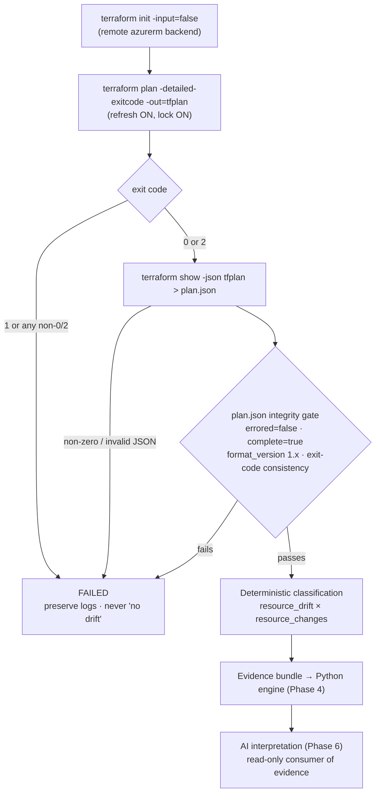

# Drift Detection Specification — Phase 3

> **Status**: Defined by Task 3.1 (2026-10-01). This is the technical contract that
> Task 3.2 (plan generation), Tasks 3.3–3.5 (deterministic classification and schema)
> and Phase 4 (Python engine) must implement. Nothing in this document is implemented
> yet; it defines *what* must be built and *how results must be interpreted*.
>
> Every behavioral claim marked **[verified]** was observed on Terraform **1.14.7** with
> azurerm **~> 5.0** against the real `aitdd-dev-main-rg` — see
> [Verification Evidence](#11-verification-evidence).

---

## 1. Objective

Detect infrastructure drift **deterministically** for the `dev` environment, producing
machine-readable evidence that later layers (Python normalization, AI analysis) consume
without ever re-deciding whether drift exists.

**Source-of-truth rule:** Terraform's refresh-and-plan, run against the remote `dev` state
and live Azure, is the **only** authority on whether drift exists. Python normalizes
Terraform's evidence; AI interprets the normalized evidence. Neither may add, remove or
override a drift finding.

## 2. Current MVP Scope

| Item | Value |
|---|---|
| Terraform root | `terraform/environments/dev` |
| Remote state | `aitdd-tfstate-rg` / `aitddtfstatesa001` / `tfstate` / `dev.tfstate` |
| Managed resources | Exactly one: `module.resource_group.azurerm_resource_group.this["main"]` → `aitdd-dev-main-rg` |
| Variable input | `dev.tfvars` (**mandatory**) |
| Terraform version | `1.14.7` (pinned in CI; must match the version that wrote `dev.tfstate`) |
| Identity (CI) | `aitdd-github-oidc` — `Reader` (subscription) + `Storage Blob Data Contributor` (`tfstate` container). Plan-only; sufficient for refresh, plan and state locking. |
| Identity (local) | Azure CLI (`az login`) with `ARM_SUBSCRIPTION_ID` exported |

Out of scope for Phase 3: any additional Azure resource, `terraform apply`, remediation,
change attribution to a person (Phase 7), and AI (Phase 6).

## 3. Detection Flow



1. **Init** against the remote backend.
2. **Plan** with refresh enabled, saving the binary plan.
3. **Gate on exit code** — process outcome only (Section 4).
4. **Export JSON** with `terraform show -json`.
5. **Gate on JSON integrity** (Section 5.3).
6. **Classify** each resource address from `resource_drift` and `resource_changes` (Section 6).
7. **Hand off** the evidence bundle (Section 8).

## 4. Terraform Command & Exit-Code Contract

### 4.1 Commands

Run from the repository root. `ARTIFACT_DIR` is an absolute path **outside the tracked
tree** (e.g. `$RUNNER_TEMP/drift` in CI, a temp directory locally), so evidence can never
be committed by accident. `plan.log` is not covered by `.gitignore`.

```bash
TF_DIR=terraform/environments/dev
terraform -chdir="$TF_DIR" init -input=false

set +e
terraform -chdir="$TF_DIR" plan \
  -var-file="dev.tfvars" \
  -input=false -no-color \
  -lock-timeout=120s \
  -detailed-exitcode \
  -out="$ARTIFACT_DIR/tfplan" > "$ARTIFACT_DIR/plan.log" 2>&1
plan_rc=$?
set -e

# only when plan_rc is 0 or 2; must run in the same initialized directory
terraform -chdir="$TF_DIR" show -json "$ARTIFACT_DIR/tfplan" > "$ARTIFACT_DIR/plan.json"
```

| Flag | Requirement | Reason |
|---|---|---|
| `-var-file="dev.tfvars"` | **Required** | `resource_groups` defaults to `{}`. Without it no resources are declared. [verified: exit 1 via module validation] |
| `-detailed-exitcode` | **Required** | Distinguishes 0 / 1 / 2. |
| `-out=tfplan` | **Required** | `show -json` must read the exact plan that produced the exit code. |
| `-input=false`, `-no-color` | **Required** | Non-interactive, parseable logs. |
| `-lock-timeout=120s` | **Required** | Keep default locking so detection never reads state mid-apply; wait instead of failing on brief contention. |
| `-refresh=false` | **Forbidden** | Hides drift completely. [verified: real drift → exit 0, no `resource_drift`] |
| `-target=…` | **Forbidden** | Partial view; un-targeted drift silently omitted. |
| `-lock=false` | **Forbidden** | Risks reading inconsistent state. |
| `-var` overrides | **Forbidden** | Detection must evaluate the committed configuration only. |
| `apply`, `-auto-approve` | **Forbidden** | Detection is read-only (Core Principle: *No autonomous apply*). |

> **Shell pitfall:** the existing workflow steps run under `set -euo pipefail`. Exit code 2
> is a *successful* outcome, so the plan step must capture its exit code explicitly
> (`set +e … plan_rc=$? … set -e`, or `|| plan_rc=$?`). Otherwise valid drift
> results kill the job and are indistinguishable from errors.

`-refresh-only` is **not** the primary mode (it reports no pending actions, so it cannot
detect configuration-side changes), but it is a valid supplementary signal: on 1.14.7 it
returns exit 2 whenever `resource_drift` is non-empty, including converged drift.
[verified]

### 4.2 Exit Codes

| Exit | Terraform meaning | Pipeline meaning | Drift implication |
|---|---|---|---|
| `0` | Succeeded, empty diff | Run **succeeded** | **Not** proof of no drift — `resource_drift` may still be non-empty (converged drift, §6). JSON must be parsed. [verified] |
| `2` | Succeeded, non-empty diff | Run **succeeded**; drift is a valid result, not a pipeline failure | **Not** proof of drift — may be a configuration change, an output-only change, or drift. [verified: all three] |
| `1` | Error | Run **FAILED** | **Unknown.** Must never be reported as "no drift". |
| other (e.g. 130, 137) | Interrupted / killed | Run **FAILED** | **Unknown.** |

**Exit codes govern process control only. Drift is determined from `plan.json`.**

**Critical [verified] hazard:** with `-out`, Terraform 1.14.7 **still writes a plan file
when plan fails** (observed for provider-authentication errors and variable-validation
errors). `terraform show -json` on that file **succeeds** (exit 0) and yields JSON with
`"errored": true`, `"complete": false` and **no** `resource_changes` / `resource_drift`
keys — which a naive parser would read as "no changes, no drift". Therefore:

- A plan file's existence is **not** evidence of success.
- Exit 1 ⇒ FAILED, regardless of whether `tfplan` / `plan.json` exist.
- The JSON integrity gate (§5.3) independently rejects `errored: true`.

Parse-time errors (e.g. invalid HCL in a var-file) produce exit 1 and **no** plan file.
[verified]

## 5. Machine-Readable Plan Contract

### 5.1 Generation

`terraform show -json tfplan` executed in the **same initialized working directory**,
with the **same Terraform version**, immediately after the plan. The binary `tfplan` is a
transient artifact; `plan.json` is the evidence.

### 5.2 Fields Consumed

Observed `format_version` on 1.14.7: **`1.2`**. [verified]

| Field | Use |
|---|---|
| `format_version` | Contract check: major version must be `1`. |
| `terraform_version` | Recorded; must equal the pinned version. |
| `errored`, `complete` | Integrity gate. |
| `applyable` | Recorded only (not a drift signal). |
| `timestamp` | Plan time. |
| `resource_drift[]` | **Drift evidence**: prior state (`before`) vs live object read during refresh (`after`). |
| `resource_changes[]` | Pending actions: refreshed state (`before`) vs desired config (`after`). |
| `output_changes{}` | Explains exit 2 with no resource changes. |
| `prior_state` | State as recorded before refresh. |
| `relevant_attributes[]` | Recorded; attributes Terraform deemed relevant to the plan. |
| `variables` | Recorded for reproducibility (may contain sensitive values — see §8.3). |

Per entry (both arrays): `address`, `module_address`, `mode`, `type`, `name`, `index`,
`provider_name`, `change.actions`, `change.before`, `change.after`, `change.after_unknown`,
`change.before_sensitive`, `change.after_sensitive`. When present, also `action_reason`,
`previous_address` (moves) and `change.importing` (imports) — these are documented
Terraform fields **not exercised** by the MVP scenario.

**Absent ≠ malformed** [verified]: `resource_drift` is **omitted entirely** (not `[]`) when
there is no drift; `resource_changes` is omitted in refresh-only plans and in errored plans.
Python may default a missing array to empty **only after** the integrity gate passes.

### 5.3 Integrity Gate (all must hold, else FAILED)

1. `plan_rc ∈ {0, 2}`.
2. `show -json` exit 0 and output parses as a JSON object.
3. `format_version` major = `1`.
4. `errored == false` and `complete == true`.
5. **Exit-code consistency.** Define *pending change* = any `resource_changes` entry
   whose actions are not `["no-op"]` (data-source `["read"]` excluded), any
   `output_changes` action other than `["no-op"]`, or any entry carrying
   `previous_address` or `change.importing`.
   - `plan_rc == 0` ⇒ no pending change. [verified]
   - `plan_rc == 2` ⇒ at least one pending change. [verified for resource and output
     actions; move/import-only plans are expected to count but are **unverified** and
     must be confirmed when first used]

A consistency violation means the evidence contradicts itself and is treated as a
detection failure, never resolved by guessing.

**Structural checks (Task 4.2).** The parser (`src/drift_engine/parser.py`) also fails
the gate, as `integrity`, when `plan.json` is larger than 50 MiB (checked before
reading), when an action list contains non-strings, when a `resource_changes` or
`resource_drift` array repeats an address, or when a resource entry nests deeper than
100 levels. Terraform does not produce any of these. Before Task 4.2 they crashed the
classifier or, for a repeated address, silently dropped an entry.

**Identity checks (follow-up to Task 4.6).** Every `resource_changes` /
`resource_drift` entry must also carry what Terraform always writes and the report
schema requires:
- a non-empty `address`;
- `mode` `managed` or `data`;
- string `type` and `name`;
- a non-empty action list;
- an `index` that is absent, `null`, an integer or a string;
- `module_address`, `provider_name`, `action_reason` and `previous_address` that are
  absent, `null` or strings.

`output_changes` action lists must be non-empty. Before this check, such entries passed
the gate. A missing `mode` silently dropped the resource, and other malformed fields
produced a report that broke the schema.

## 6. Drift vs Configuration Change

`terraform plan` compares **three** views of each resource:

| View | Source in `plan.json` |
|---|---|
| **S** — recorded state | `resource_drift[].change.before` (or `resource_changes[].change.before` when no drift entry exists) |
| **R** — real / refreshed | `resource_drift[].change.after` (equals S when no drift entry exists) |
| **D** — desired | `resource_changes[].change.after` |

`resource_drift` = S ≠ R (something outside this plan changed the remote object).
`resource_changes` = R ≠ D (what Terraform would do now).
**A plan change alone does not identify drift**: a configuration edit and an external
change both yield exit 2 and an `update` in `resource_changes`. Only `resource_drift`
separates them. [verified]

### 6.1 Resource-Level Classification

| Class | `resource_drift` | `resource_changes` action | Meaning | Verified case |
|---|---|---|---|---|
| `in_sync` | absent | `no-op` | No drift, nothing to do. | Baseline: exit 0 |
| `external_drift` | `update` | non-no-op | Live object diverged; Terraform would revert it. | Tag change: exit 2 |
| `external_deletion` | `delete` | `create` | Object deleted outside Terraform. | Deleted RG: exit 2 |
| `converged_drift` | present | `no-op` | Live object diverged from state but already matches config (e.g. same edit made in Azure and code). **Drift exists although exit = 0.** | exit 0 |
| `config_change` | absent | `update` / `replace` (or a move/import) | Desired state differs from recorded state; no external change observed. | tfvars edit, location change (replace): exit 2 |
| `resource_added` | absent | `create` | Configuration declares an object not in state (config-side refinement of `config_change`, Task 3.3). | New `for_each` key: exit 2 |
| `resource_removed` | absent | `delete` | Configuration no longer declares a recorded object (config-side refinement of `config_change`, Task 3.3). | Removed `for_each` key: exit 2 |
| `drift_and_config_change` | present | non-no-op, and attribute rule §6.2 finds both (or `delete` of a drifted object) | Both sides changed. Flagged `ambiguous` when the **same** attribute is `drifted_and_config_changed`. | State≠Azure and tfvars changed the same tag: exit 2 |
| `undetermined` | present | non-no-op that no §6.2 attribute explains (e.g. only unknown values) | Evidence insufficient; always `ambiguous`. Never resolved by guessing (Task 3.3). | — (synthetic test only) |
| `output_only_change` | — | all `no-op`, outputs changed | Not drift. Reported as the plan-level `summary.output_only_change` flag, not a resource class. | Output removal: exit 2 |

### 6.2 Attribute-Level Rule (top-level attributes)

For a resource with entries in both arrays and attribute *a*:

| Condition | Attribute class |
|---|---|
| S[a] ≠ R[a] and D[a] = S[a] | `drifted` — plan would revert the external change |
| S[a] ≠ R[a] and D[a] = R[a] | `drifted_converged` |
| S[a] = R[a] and D[a] ≠ S[a] | `config_changed` |
| S[a] ≠ R[a] and D[a] ∉ {S[a], R[a]} | `drifted_and_config_changed` — **ambiguous; report both, infer neither** |
| `after_unknown[a] == true` | `unknown_until_apply` — not classifiable from the plan |

### 6.3 Limitations — Stated, Not Hidden

- **`config_change` means "desired ≠ recorded"**, not "someone edited a `.tf` file". It
  can equally come from `dev.tfvars`, a module change, or a provider upgrade altering
  defaults. Terraform cannot tell these apart; the engine must not claim which one it was.
- **`resource_drift` means "remote ≠ recorded"**, not "a person changed Azure". It can
  also come from provider normalization, provider schema upgrades, or values computed by
  Azure. Who or what changed it is out of Terraform's view (Phase 7, Activity Log).
- Terraform does **not** surface drift on Azure properties or resources that the
  configuration does not manage. Unmanaged resources are invisible to this method.
- A changed resource that was **never recorded in state** (e.g. created out-of-band) is
  not detected.
- **Relevance filtering is unproven.** In every MVP case, `relevant_attributes` covered the
  whole resource, so it is unverified whether Terraform omits drift that is "irrelevant" to
  the plan from `resource_drift`. When a resource with irrelevant attributes is introduced,
  run `-refresh-only` as a cross-check before relying on the normal plan alone.
- Classification is per top-level attribute. Nested map/list diffs (e.g. individual tag
  keys) are reported as a whole attribute change here; finer diffing is Task 3.4 scope.
- A simultaneous config edit and external change on the same attribute is reported as
  ambiguous, never resolved.

## 7. Resource Group MVP Scenario

| Phase | Action | Expected deterministic signature |
|---|---|---|
| Baseline | None (Task 2.5 state) | exit 0; `resource_drift` absent; `this["main"]` → `no-op` → `in_sync` |
| Inject | External change to a mutable property of `aitdd-dev-main-rg` via Azure CLI (Task 3.6; candidate: tags) | exit 2; `resource_drift` `update` **and** `resource_changes` `update` on `module.resource_group.azurerm_resource_group.this["main"]`; attribute `tags`: S ≠ R, D = S → `external_drift` / `drifted` |
| Revert | Restore the property (Task 3.6 revert script) | Returns to the baseline signature |

Task 3.1 proved the signature by **simulation** (§11): the scratch copy's recorded state
was altered while live Azure was only read. This proves the azurerm provider refreshes
`tags` from Azure and that `resource_drift` reports the divergence. A **real** external
Azure mutation is not performed here; it remains Task 3.6/3.7 work and requires explicit
approval at that point.

## 8. Evidence Contract for Python (Phase 4 Input)

### 8.1 Evidence Bundle (produced per run by Task 3.2 tooling)

| Artifact | Required | Content |
|---|---|---|
| `plan.json` | When `plan_rc` ∈ {0, 2} | Unmodified `terraform show -json` output |
| `plan.log` | **Always** | Combined stdout/stderr of `plan`, `-no-color` |
| Run manifest `detection_run.json` | **Always** | `plan_exit_code`, `show_exit_code`, `outcome` (`succeeded` / `failed`), `failure_stage` (`preflight` / `init` / `plan` / `show` / `integrity`), `failure_reason` (diagnostic text; `null` on success), `terraform_version`, `environment` (`dev`), `working_dir`, `backend_key` (`dev.tfstate`), `git_commit`, `started_at`, `finished_at`, `run_id` (CI run id or local marker) |
| `tfplan` (binary) | No | Transient; not consumed by Python |

A failed run **still produces a bundle** (manifest + log), so failure is explicit
evidence, not missing evidence.

**Implementation (Task 3.2):** `scripts/generate_plan_json.sh`. Process exit status is
`0` = run succeeded (plan exit 0 *or* 2; read `plan_exit_code` from the manifest), `1` =
detection failed, `64` = unusable `ARTIFACT_DIR` (relative, inside the repository, or
non-empty), the only case where no manifest can be written. A missing manifest must
therefore also be treated as a failed run. `preflight` covers checks made before
Terraform runs: required tools, the pinned Terraform version, the var-file being present,
and refusing `TF_CLI_ARGS*`, which could inject forbidden flags.

### 8.2 What the Phase 4 Engine Receives and Must Do

- Input: the run manifest and, for succeeded runs, `plan.json`.
- **Must** re-apply the integrity gate (§5.3) itself, not trust upstream.
- **Must** produce a report for failed runs with `outcome: failed`, and **must not** emit
  `has_drift: false` for them. Drift status for a failed run is `unknown`.
- **Must** classify per §6 using only `plan.json` fields, so the same `plan.json` always
  yields the same report.
- **Must not** call Azure, Terraform, or an LLM to decide drift.
- Report schema = Task 3.5 (`schemas/drift_report.schema.json`). It describes the
  classifier output below directly. There is no separate normalized artifact.
- Python form of the same contract (Task 4.3): strict Pydantic models in
  `src/drift_engine/models.py` (`DriftReport`, `DriftSummary`, `DriftItem`,
  `AttributeChange`). They accept exactly what the schema accepts, except that they
  reject whole-number floats such as `1.0` where the schema expects an integer.

**Plan parsing (Task 4.2):** loading `plan.json`, the §5.3 gate and S/R/D extraction live
in `src/drift_engine/parser.py`. Classification lives in `src/drift_engine/classifier.py`
(moved there in Task 4.6). `scripts/detect_drift.py` is a thin wrapper that imports both
from `src/` (no installation needed); its output is unchanged.

**Engine CLI (Task 4.6):** `drift-engine analyze --plan PLAN [--manifest MANIFEST]
[--output PATH] [--format json|yaml|console]`.
- JSON (default) and YAML are this report, validated against the Task 4.3 models before
  writing. With `--manifest`, the JSON is byte-identical to `scripts/detect_drift.py`
  output for the same bundle.
- `console` is a readable view of the report, including the Task 4.4 assessment and
  Task 4.5 severity. Both are part of the report since `classification_version` 2
  (Task 6.2A, below).
- **Without `--manifest`**, the two manifest-based gate checks (plan exit-code consistency,
  Terraform version) are skipped, every `run` field is `null`, and a warning is printed.
  All other gate checks still apply. Pass the manifest whenever one exists.
- Exit codes: `0` classified, `1` evidence failed or rejected (report still written, drift
  status unknown), `2` usage, `70` the report would break the contract or an unexpected
  internal error occurred (nothing written, drift status unknown), `73` output not
  writable, `130` interrupted, `141` standard output closed early.
- `--output` is written atomically (temporary file in the same directory, then rename).
  Failure keeps an existing report, permissions included. An existing report keeps its
  permission bits (never widened); a new one gets `0666` minus the umask; an unwritable
  report is refused (`73`). The directory must be writable; there is no non-atomic
  fallback. A symlink at the output path is replaced, never written through. A
  hard-linked report gets a new inode.
- **Logging (Task 4.7):** structured events through the standard `logging` module
  (`src/drift_engine/logs.py`). Off by default, both for library callers and the script;
  enabled with `--log-level` / `--log-format text|json`. Logs go to standard error, never
  into the report. Event fields carry identifiers, counts, stages and failure reasons,
  never attribute values, so §8.3 redaction cannot be bypassed through log events. The
  exception is an unexpected internal error (exit `70`): its message is printed to standard
  error and, at debug level, its traceback is logged. These engine-defect diagnostics
  contain whatever text that exception carried.
- Exit `70` is defense in depth. The identity checks in §5.3 reject the malformed resource
  fields that previously reached the report, so for gate-passing input it indicates an
  engine defect.

**Classifier (Task 3.3):** `scripts/detect_drift.py ARTIFACT_DIR` writes
`ARTIFACT_DIR/drift_classification.json`, containing `outcome`, `has_drift`
(`true`/`false`, or `null` when evidence failed or was rejected), `failure`, run and plan
metadata, `summary`, per-resource `classification`, `action`/`drift_action`,
`action_reason`, attribute **names** with their §6.2 class, `ambiguous` and `notes`.
`attributes` carries names only. Values are in Task 3.4's `attribute_changes` (below).
`has_drift` is `true` exactly when `resource_drift` contains a managed resource. Exit
status: `0` classified, `1` failed/rejected, `64` usage error.

**Drift report contract (Task 3.5):** the classifier output **is** the project's drift
report. `PROJECT_PLAN.md` calls it `drift_report.json` (Tasks 3.5, 3.7, 5.3, 5.4, 6.2,
6.7, 13.3). The file `scripts/detect_drift.py` writes today is named
`drift_classification.json`. Both names refer to the same document, and its contract is
`schemas/drift_report.schema.json` (JSON Schema Draft 2020-12). A sample generated from
the `external_drift` fixture is in `schemas/examples/drift_report.json`.

There is no separate `header` object. The report header in Task 3.5 maps to existing
fields:

| Header item | Field |
|---|---|
| timestamp | `plan.timestamp` (`run.started_at` / `run.finished_at` for the run itself) |
| environment | `run.environment` |
| target | `run.working_dir` + `run.backend_key` |

The file name is a known, unresolved naming difference. The output file was deliberately
not renamed, because that would change the Task 3.3 contract.

**Attribute detail (Task 3.4):** the same output gains two fields. No Task 3.3 field is
changed.

- Per resource, `attribute_changes`: one entry per changed **leaf path**. Maps and objects
  are descended key by key (e.g. `["tags", "owner"]`); lists are compared as whole values.
  Each entry has `path`, `attribute` (top-level name), `class`, `state` / `real` /
  `desired` (the S/R/D views of §6), and `redacted`.
  - `class` is the §6.2 rule applied at that leaf. It is `null` when the object is absent
    from a view (create/delete), because §6.2 is defined only for objects present in all
    three views.
  - Each view value is `{"status": "value", "value": …}` (`null` is a value),
    `{"status": "absent"}`, `{"status": "unknown"}` (desired value unknown until apply),
    or `{"status": "redacted"}`.
  - **Redaction (§8.3):** a path flagged in any `before_sensitive` / `after_sensitive`
    mask of the resource's drift or change entry is redacted in **every** view, and a
    sensitive subtree is reported once without descending. A value reported whole (a
    list, which includes every nested block in plan JSON) is redacted when a mask flags
    it **or anything inside it**, e.g. `{"site_config": [{"password": true}]}` redacts
    the whole `site_config` value. No sensitive value is emitted. This is the redaction
    format; §8.3 previously defined none. (Before Task 6.2A, a flag inside a list was
    missed and the list was emitted in clear; fixed with regression tests.)
- Top level, `resource_types`: resources grouped by Terraform `type`, sorted, each with
  `resource_count`, `addresses` and `classification_counts`.

**Deterministic severity in the report (Task 6.2A, `classification_version` 2):** the
classifier runs the Task 4.4 comparator and the Task 4.5 severity rules while it still has
the raw plan (configuration section and whole objects), and writes the result into the
report. No field above changes; the version moves from `"1"` to `"2"` because the new
fields are required.

| Where | Field | Content |
|---|---|---|
| each `attribute_changes` entry | `severity` | `{"level", "rules"}`: `CRITICAL`…`INFO` and the ids of the severity rules that set it (empty for noise and for the unmatched `MEDIUM` default) |
| each `attribute_changes` entry | `assessment` | `{"category", "noise_rule"}`: `configured` / `unconfigured` / `noise` / `undetermined` and the matching noise rule id |
| each resource | `severity` | `{"level", "reasons"}`: highest change severity raised to the classification/action floor, with the reasons |
| `summary` | `highest_severity`, `severity_counts` | highest resource level (`INFO` when there are none) and resources per level |

This rating is **authoritative** (§10.6). Report consumers, including the Phase 6 AI
engine, read it and never re-derive it, so they never need `plan.json`. A failed report has
no resources and no summary, so it carries no severity: drift status stays unknown, never
`INFO`.
- Non-sensitive identifiers (e.g. resource `id` values containing the subscription ID)
  are emitted as values. Like every evidence artifact, the output stays outside the
  repository (§4.1).

### 8.3 Handling Sensitive Data

`plan.json` and `tfplan` can contain values marked sensitive **in clear text**. The
`before_sensitive` / `after_sensitive` maps identify them. Plan artifacts are already
excluded by `.gitignore` (`tfplan`, `*.tfplan`, `plan.json`); the whole bundle is
additionally written outside the tracked tree (§4.1) and must never be committed.
Before persisting reports or passing data to AI, the engine must redact every value flagged
sensitive. The MVP Resource Group has no sensitive attributes (`before_sensitive:
{"tags": {}}`), but the rule applies from the start.

**CI publication (Task 5.4):** the public-repository workflow publishes only
`drift_report.json` and `detection_run.json`, as the `drift-report-<run_id>` artifact
(30-day retention). `tfplan`, `plan.json` and `plan.log` are generated, gated and consumed
on the ephemeral runner (`$RUNNER_TEMP`); they are kept only there and are not uploaded or
otherwise persisted by this workflow. The published report is the contract report
(sensitive values redacted by the engine). Values Terraform does not flag sensitive are not
redacted: when a resource `id` changes, its before/after values (which contain the
subscription ID) can appear in the report.

**Issue publication (Task 8.1):** for a valid drifted run (`drift_detected` literally
`"true"`), the workflow's `issues` job (`contents: read`, `issues: write`; no `id-token`, no
Azure) downloads this run's `drift-report-<run_id>` artifact and `scripts/github_automation.py`
creates or updates one GitHub Issue per resource with `drift_action != null`. Issues are
public and permanent, so they follow a stricter profile than the artifact: structure only
(address, type, classification, drift action, severity, changed paths and S/R/D value
*status*), never real/state/desired values, HCL fragments, severity reasons, Activity Log
data or caller identity; paths are withheld (reduced body) unless the resource is INFO/LOW,
not a security-sensitive type and has no redacted change; subscription/tenant GUIDs and ARM
IDs are masked; map keys outside `[A-Za-z0-9_.-]{1,64}` are replaced by a placeholder; all
untrusted text is rendered only inside code spans. The script accepts only evidence from
the same run attempt (`run.run_id == github-<run_id>-<run_attempt>`), publishes only inside
GitHub Actions, and updates an issue only when the evidence is newer (`plan.timestamp`) and
the content differs.

**Issue closure (Task 8.3):** the same job also runs for a valid no-drift run (`drift_detected`
`"false"`; never `unknown`). An open automation issue is closed only when its marker fingerprint
equals `fp(environment, address)` for an address present in this run's report with
`drift_action == null` and the run's `plan.timestamp` is newer than the marker's. A `"false"` run
never creates or updates issues. Closing is exactly `{"state": "closed", "state_reason":
"completed"}`: no body, title, label or comment, so closure publishes no data at all. Issues whose
fingerprint matches no report address (removed or moved resources) stay open; a recurrence opens
a new issue.

## 9. Future Extensibility

The contract stays valid as resources are added:

- Classification is keyed on `address` / `type` / `change.actions` and is **resource-type
  agnostic**. A new resource type needs no new detection logic.
- `for_each` instances are distinct addresses (`this["main"]`, `this["x"]`).
  `module_address` gives grouping.
- `mode == "data"` entries are reads, not managed infrastructure, and are never drift.
- Per-type **noise rules** (attributes known to drift through Azure-side normalization)
  belong in Python as declarative data, applied *after* classification and recorded in the
  report. They must never cause a resource to be removed silently.
  **Implemented in Task 4.4** (`src/drift_engine/comparator.py`, `NOISE_RULES`):
  - Each changed path is assessed as `configured` (its top-level attribute appears in
    `configuration` expressions), `noise` (matches a rule *and* is proven not configured),
    `unconfigured`, or `undetermined` (no configuration evidence for the resource).
  - Configuration always wins over a rule, and nothing is dropped. Only proven noise is
    left out of the "significant" view.
  - Classification and the report are unchanged. Recording the assessment in the report
    is not done yet; it needs a schema change (Task 4.6 or later).
- `lifecycle.ignore_changes`, moved blocks (`previous_address`) and import blocks
  (`change.importing`) affect `resource_changes`. Their interaction with `resource_drift`
  must be verified empirically when first introduced; they are not exercised by the MVP.
- Additional environments: one run and one evidence bundle per root module + state key. No
  cross-environment aggregation inside a single plan.
- Larger estates mean slower refresh and more Azure read calls. The contract does not
  change, but `-lock-timeout` and CI timeouts may need tuning.

## 10. AI Boundary — Source-of-Truth Rule

1. Terraform decides **whether** drift exists. Python **normalizes** that decision.
   AI **interprets** it.
2. AI receives the normalized drift report (and, where needed, redacted plan excerpts) as
   **read-only input**. It cannot change `outcome`, a resource's class, or the drift count.
3. Detection is **LLM-independent**: a complete, correct drift report must exist even if
   the LLM is unavailable or fails.
4. AI output is labeled **inference** and kept separate from Terraform **evidence**. AI
   must not claim *who* made a change; attribution needs Phase 7 Activity Log evidence.
5. A failed detection run is never handed to AI as "no drift".
6. **Severity baseline (Task 4.5):** `src/drift_engine/severity.py` rates every change
   `CRITICAL`/`HIGH`/`MEDIUM`/`LOW`/`INFO` with declarative rules, deterministically and
   without an LLM.
   - Proven noise is `INFO`; an unmatched significant change is `MEDIUM`. Unknown impact is
     never rated down.
   - AI may add context to this rating but does not replace it.
   - It is an annotation only: it changes no classification. Since Task 6.2A it is part of
     the report (§8.2, `classification_version` 2).
7. **Deterministic severity is authoritative (Task 6.2A).** AI nodes read the report's
   `severity` fields and may explain them or add context. They must not compute, lower or
   replace a rating, and an AI-assessed impact is always shown next to, never instead of,
   the deterministic level. The AI engine does not import the comparator, parser or
   severity modules and never reads `plan.json`.
8. **No re-classification by AI.** `outcome`, `has_drift`, resource classes, attribute
   classes, actions, `ambiguous`, `redacted`, counts and severity are decided
   deterministically. The Phase 6 `classify_drift` node (Task 6.3) is deterministic routing
   of changes that are security-relevant for analysis; it does not re-classify drift.

## 11. Verification Evidence

Method (2026-10-01, Task 3.1): a scratch copy of `terraform/environments/dev` was placed
**outside the repository** with a **local** backend. It was seeded from a **read-only**
`terraform state pull` of the real `dev.tfstate`, and the existing provider binaries were
reused (`init -plugin-dir`, no downloads). Each scenario altered only the scratch state
copy and/or a scratch tfvars copy. `plan` then refreshed against the **real**
`aitdd-dev-main-rg` (read-only). No `apply` was run, no Azure resource was modified, and
the real remote state was neither locked nor written.

| # | Scenario | Exit | `resource_drift` | `resource_changes` (`this["main"]`) | Notes |
|---|---|---|---|---|---|
| S0 | Baseline | 0 | absent | `no-op` | `format_version` 1.2, `errored` false, `complete` true |
| S1 | Config change (tfvars adds tag) | 2 | absent | `update` | Configuration change, no drift |
| S2 | External drift (state≠Azure, config=state) | 2 | `update` (tags) | `update` | Drift signature |
| S3 | Converged drift (state≠Azure, config=Azure) | **0** | `update` (tags) | `no-op` | Drift present despite exit 0 |
| D1 | Resource deleted outside Terraform | 2 | `delete` | `create` | (non-existent `ghost` instance; Azure read only) |
| F1 | Output removed + converged drift | 2 | `update` | `no-op` | `output_changes` `delete` ⇒ exit 2 without resource changes |
| R1–R3 | `-refresh-only` (none / drift / converged) | 0 / 2 / 2 | absent / `update` / `update` | absent | Refresh-only = pure drift signal |
| P1 | `-refresh=false` with real drift | **0** | absent | `no-op` | Drift hidden → flag forbidden |
| E1 | Missing `-var-file` | 1 | absent | absent | **Plan file written**, `errored: true`, `complete: false` |
| E2 | Invalid var-file (HCL error) | 1 | — | — | No plan file |
| E3 | Provider auth failure (bad subscription) | 1 | absent | absent | **Plan file written**, `errored: true`, `complete: false` |
| — | `show -json` on missing plan file | 1 | — | — | — |

## 12. Acceptance Criteria

**For this specification (Task 3.1):**

- [x] `terraform plan -detailed-exitcode -out=tfplan` strategy specified (§4).
- [x] Conversion via `terraform show -json tfplan` specified (§5).
- [x] Exit codes 0 / 2 / 1 defined as process outcomes, decoupled from drift (§4.2).
- [x] Configuration change vs drift vs failure distinction defined, with limitations (§6).
- [x] Resource Group MVP scenario and expected signatures defined (§7).
- [x] Evidence bundle and Phase 4 input contract defined (§8).
- [x] Failure is never "no drift" (§4.2, §5.3, §8.2).
- [x] AI boundary stated (§10).
- [x] Behavior verified on the installed Terraform version (§11).

**For implementations of this contract (Tasks 3.2 → Phase 4), verified when built:**

- [ ] Exit 1 / other / show failure / integrity-gate failure ⇒ `outcome: failed`, drift `unknown`.
- [ ] Exit 2 does not fail the CI job by itself.
- [ ] An errored plan file with `errored: true` is rejected even though `show -json` succeeds.
- [ ] The S2 and S3 signatures are both classified as drift (S3 despite exit 0).
- [ ] The S1 signature is classified as `config_change`, not drift.
- [ ] Forbidden flags (`-refresh=false`, `-target`, `-lock=false`, `-var`) are absent.
- [ ] Plan artifacts are never committed; sensitive values are redacted before AI.
